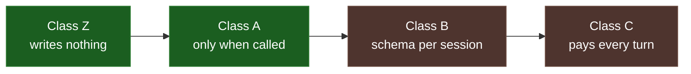
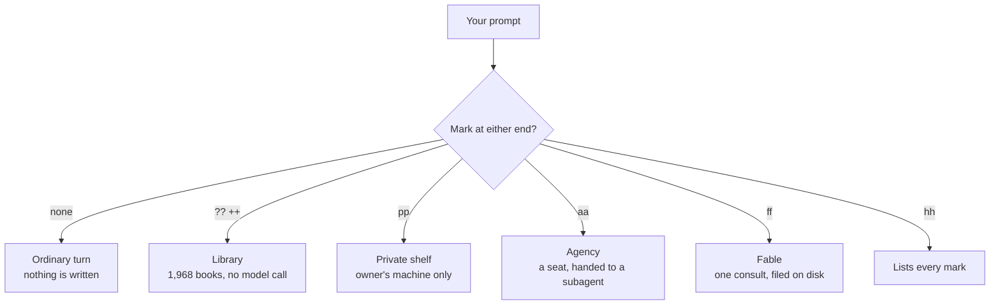
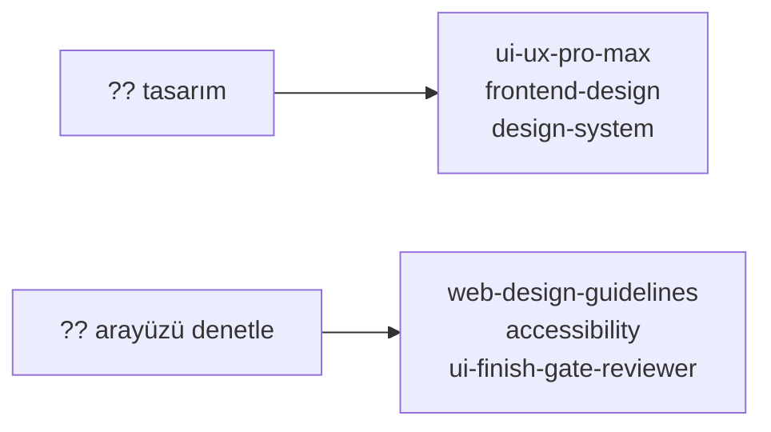
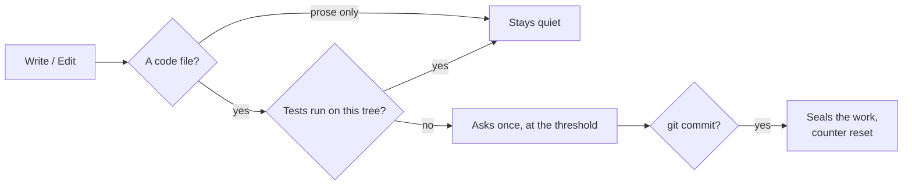
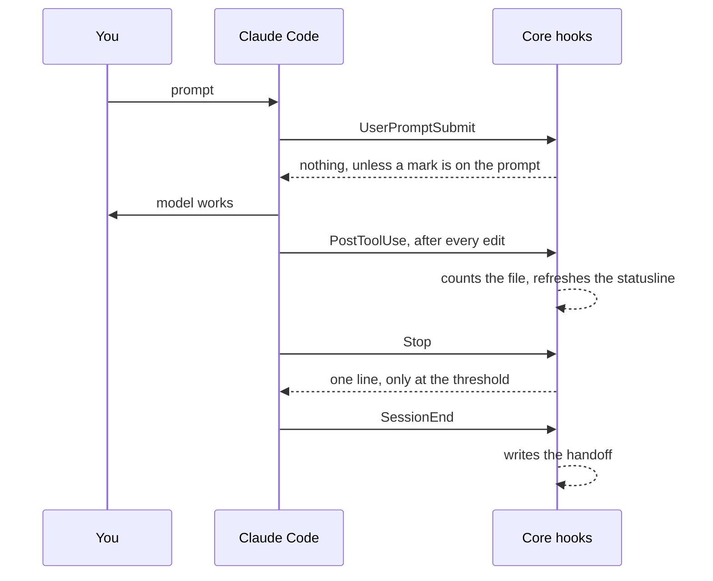

<!-- lang -->

[](README.tr.md)

# Teknesyum Core

Counts, Shows, And Speaks Once

---

## The Scan

We did not guess what belonged in here. We read the market.

| | |
|---|---|
| Repositories looked at | 1,000 |
| Read end to end, by 45 Opus agents | 963 |
| Taken into the library | 93 |
| Kept as an idea note, not shipped | 165 |
| Declined | 705 |
| Shelves shipping today | 38 |
| Books in the catalog | 1,968 |

None of them is installed. The catalog is a file on disk, searched without a model, and no
shelf ever enters an ordinary turn's context.

---

## The Numbers First

Every claim below was measured against plain Claude Code on the same seat (sonnet, low
effort), clean config, 2026-09-05 and 2026-09-06. Method, tables and raw rows are in
[bench/rapor.md](bench/rapor.md); the whole bench cost about 40 $.

| What was measured | Plain Claude Code | Core 0.16 |
|---|---|---|
| Ordinary turn, bytes the hooks write into the context (200 turns) | 0 | 0 |
| Ordinary turn, extra tokens per turn, p50 / p95 | - | +207 / +427, all cache read, 0.0001 $ |
| Tasks 02-05, median cost, five runs each | 0.11-0.39 $ | within 3 % or cheaper, all pass |
| Task 06, four files and ~185 lines, three runs | 0.34 $, 3/3 pass | 0.37 $, 3/3 pass, hook silent 3/3 |
| The one line the hook speaks, when it speaks | - | ~450 tokens, 0.0007 $, no extra tool call |
| Resume: session cut at six turns, next session says "continue" | 0/3 finished | 3/3 finished; second session 0.33 $ vs 0.11 $ |
| The removed 0.15 machinery put back whole | - | 4-8x the cost, 7-15 agent calls, same acceptance |
| Each removed 0.15 part put back alone | - | inside or above the baseline range, nothing the acceptance could see |

The table was measured on Core 0.16.0; the hook surface changed in v0.16.1 and again through v0.24.0 (`count.js`, `handoff.js`, `mod.js`, `scout.js`, `loop.js`), and the table is not re-measured.

What that says in one breath: on a turn where nothing happens, Core costs nothing. On a
task, Core costs what plain Claude Code costs. The one thing it buys is a session that can
be cut and picked up again; that is where the money goes, and it goes there because the
second session does the work instead of saying "looks fine".

The last two rows are the design proof. The previous version gated multi-agent work behind
contracts, roles and tiers. Put back whole, it passed the same tasks at four to eight times
the price. Put back one piece at a time, with the decision rule written before the runs,
no piece moved the acceptance column and none came back. Section 8 of the report has the
rows; the variants live under `bench/varyant/` and rerun with one command.

---

## Why Big Tools Were Not Bundled

Every one of these was read. None was rejected for being bad; each was rejected for what it
costs on a turn where nothing happens.

| Tool | Why it is not in here |
|---|---|
| [Obsidian](https://obsidian.md) | A whole note vault beside the repo. What we needed from it was one handoff file, and that is `handoff.js`. |
| [graphify](https://github.com/hongkongkiwi/graphify) | Excellent on a large codebase, and we still recommend it. It indexes; we did not want an index in every session, so `map.js` runs only when called. |
| [Context7](https://context7.com) | Live documentation on demand. It is a per-turn context cost by design; our rule is that an ordinary turn costs nothing extra. |
| [superpowers](https://github.com/obra/superpowers) | The broadest skill framework there is. Its own lab shelf is in our library; the framework itself keeps a schema in context every session, which is the one thing we do not do. |

The line between class Z and class C is the whole plugin: Z writes nothing ever, A writes
only when you call it, B keeps a schema per session, C pays on every turn. Core ships Z and
A. Nothing above them.



Green is what Core ships. Brown is what it refused.

---

## What It Is

Teknesyum Core is a plugin for Claude Code that adds nothing to an ordinary turn. It counts
the files a session touches, shows the count on the statusline, and speaks into the
conversation exactly once, when the work has grown past a threshold and there is no plan on
disk. When the session ends, or when the context window fills up, it writes a handoff file
the next session resumes from with one word: "continue".

Everything Claude Code already does natively - subagents, worktrees, plan mode, hooks, the
statusline - is left alone. Nothing is wrapped, gated or rewritten.

---

## What It Does

### Count

After every `Write`, `Edit` and `NotebookEdit` the hook records the touched file and asks git
how many lines changed. Below the threshold it writes nothing: zero bytes into the context.

The threshold is five files, or a hundred and fifty changed lines in tracked files, or a
single file whose path looks risky: `migrations/`, `auth`, `secur`, `config`, a lock file,
`.github/`, a `Dockerfile`. Lines in brand-new files are shown but do not count toward the
line threshold; a task that writes three fresh files is not a task that needs a plan. When
the threshold is crossed and there is no `docs/plan.md`, one line arrives, once per session:

> 5 files touched and no plan. Write docs/plan.md or say skip.

That is the whole conversation. The model writes the plan or says skip; the hook never asks
again.

### Show

The statusline reads the same state: files touched with added and removed lines, whether a
plan exists, the tests the session ran and how many failed, the context percentage, whether
a handoff is waiting, open bug logs, and hook errors if any. Plain text, no colours or
measures invented here.

When a hook acts, the user sees one chat line such as `Teknesyum Core > Kütüphane Döndü · 3
Kitap Uydu · En Çok Üçü Okunacak`. It travels in the hook's `systemMessage`, which the chat
shows and the model never reads, so the line costs no tokens. Session start, marks, the
threshold, the evidence gate, the denylist and the later-queue each have one.

It also counts processes the session spawned through a shell that have been running for
more than thirty minutes: `⏳ 2 processes 40 min`. The count is refreshed by a detached
process at most once a minute, so the statusline never waits on it, and the chime rings
once when the first stale process appears. Nothing is stopped; a ninety-minute job is
allowed to take ninety minutes, the line only says it is still there.

### Bound

Before every `Bash` and `PowerShell` call the hook looks for a wait loop with no upper
bound: `until` or `while` around a `sleep`, with no `timeout`, no counter, no deadline.
Such a loop sits forever when what it waits for never comes. The call is denied with one
line that says how to bound it; the model picks the bound from the job and runs again.
Everything else passes without a byte.

### Handoff

When the context passes sixty percent, or when the session ends, `.claude/handoff.md` is
written by the machine. It opens with one rule line - read the task, then the changed files,
continue from the first unfinished part, do not redo what the diff already shows - and then
carries `task`, the session's first prompt read from the transcript; `changed_files` from
`git diff --stat`; `tests_run` from the commands the hook saw, their exit code and the tree
hash of that moment; `steer`, the last three prompts after the first; and `plan` if there is
one. Two sections are left for the model, `decisions` and `next_action`,
and one line asks for them at the threshold:

> Context 64%. Fill decisions and next_action in .claude/handoff.md.

A regenerated handoff keeps what the model wrote. The next session start says one line,
`Resume: .claude/handoff.md`, and nothing else. When the work is finished, the file goes to
`trash/`.

### Chime

A sound when Claude is waiting on you - a permission prompt, a question, a dialog - and
silence for everything that does not need you. Off with one setting.

### Consult

A prompt that starts with `??` or `++` opens the library first. The `hooks/mod.js` hook
runs `kutuphane.js find` on the words, with no model call, and puts up to eight hits and a
three-line rule into that turn's context; the model reads at most three books lean, names the
source on one line and works with that expertise. Turkish words are folded and mapped to the
English catalog, and matches are whole words. A prompt that starts with `pp` opens the
private shelf instead: the owner's own books under `~/.claude/teknesyum-private/private/`,
whole (8 KB cap), announced to the user as `Teknesyum Core > Özel Raf Açıldı`; the shelf exists only
when that mirror's remote is the owner's, so on any other machine `pp` says so and stops.
A prompt that starts with `aa` opens the agency: `agency.js find` on the words, at most three seats and one rule in the context; the model reads the seat lean, hands it with the question to a subagent in Turkish and records the reply under `docs/danisma/`. An ordinary turn gets nothing from any of them. The word `netleştir` asks instead to sharpen
the question: `advice.js ask` writes it under `docs/netlestirme/`, the gate in
`hooks/scout.js` lets it out once, `record` files the answer.




### Tools that only run when called

| Script | What it does |
|---|---|
| `scripts/map.js .` | Import graph: hubs, cycles, orphans. `map.js who <file>` says what imports it. |
| `scripts/log.js write` | A bug log with a fixed shape, into the project's own repository. |
| `scripts/advice.js` | `ask <question> [--facts <file>]` writes a `??` question under `docs/netlestirme/` and arms the gate for one call on any model; `record` files the answer; `list` shows the records under `docs/danisma/`. |
| `scripts/kutuphane.js` | The library: shelves cloned outside the project (`fetch`), a catalog built from front matter or the first heading and paragraph, `find <words>` scored without a model, `show <slug…> --lean` capped at three books and 48 KB, `record` under `docs/danisma/`, `push private` commits and pushes the private shelf, `stale [days]` lists how long ago each shelf was fetched, `fetch all --stale 7` pulls only the ones older than that. Thirty-eight shelves ship in `core/kutuphane.json` (1,968 books; MIT, Apache-2.0, CC0, CC BY-SA 4.0 and one CC BY-NC-SA 4.0; the picks are in `docs/kutuphane/`; the 2026-09-08 market scan of 1000 repositories, 963 read and 93 marked take, is in `docs/kutuphane/piyasa-2026-09-08.md`), plus `raf add <slug> <url> --kind agents|skills|prompts|docs`; the kind decides what counts as a book. Nothing is installed, so no shelf ever enters the context. |
| `scripts/agency.js` | A seat from [agency-agents](https://github.com/msitarzewski/agency-agents), on demand: now the `agency` shelf of the library, same commands: `find ui` picks, `show <slug> --lean` hands the role to a subagent without its personality and metrics blocks, `record` files the exchange under `docs/danisma/`. `show` leaves a seat mark that the next `Stop` prints in the chat as `Seat: <slug> read, <n> KB`; the line never enters the context. Nothing is installed as an agent, so the roster never enters the context. |
| `scripts/manset.js` | Checks a Markdown report: every number in prose must appear in the same section's table or list. |
| `scripts/scaffold.js` | License, signature block, language link: fixed texts the model never types. |
| `scripts/setup.js` | Machine setup: language, chime, private repository, projects folder. |
| `scripts/doctor.js` | Seven checks: node, git, version, hooks, statusline, map, logs. |
| `scripts/scan.js` | Seven read-only checks on the project itself: license surfaces, plan against the five-file threshold, handoff holes, documents against the version, test script, `trash/` references, map. Nothing written, no model, nothing into context; the profile only widens the document set. |
| `scripts/scout.js` | Prior-art scout, on demand and once: `brief <topic>` writes a bounded brief under `docs/oncul/` (5 searches, 3 pages, 5 candidates, 400 words) and arms the gate; the brief goes to one subagent on sonnet; `record` files the answer, cut at 8,000 characters. The gate in `hooks/scout.js` refuses a second call on the same brief, another model, or a longer prompt. |
| `scripts/release.js` | Bumps the version from the notes left in `.changes/`, rewrites the install lines, tags; `publish` creates the GitHub release titled `vX.Y.Z` and uploads both installers with their `.sha256` files. |

---

## Design And UI Review

Design work and design review are two different jobs, so the library carries both. Five
shelves were added for them after a second sweep of the market.

| Shelf | What it is for |
|---|---|
| `ui-ux-pro-max` | Designing: 67 styles, 96 palettes, 57 font pairings, across 13 stacks. |
| `anthropic-skills` | Designing: `frontend-design`, `brand-guidelines`, `canvas-design`, from Anthropic's own repository. |
| `addyosmani-skills` | Both: `frontend-ui-engineering` builds accessible, responsive UI; the accessibility checklist reviews it. |
| `react-best-practices` | Reviewing: `web-design-guidelines` reads finished UI code against the Web Interface Guidelines. |
| `pair-design` | Designing: a framework for working through a design with the user rather than at them. |

Alongside what was already there — `refactoring-ui`, `web-design`, `ecc/skills/design-system`,
`ecc/skills/accessibility`, the `design` seats of the agency. Nothing is installed; `?? ui`
or `?? arayüzü denetle` finds them, and an ordinary turn sees none of it.



---

## What Went Out

Version 0.16 is a subtraction release. These left the plugin; the `v0.15.0`
tag holds every one of them, and `bench/varyant/` names the source of each part it measures:

- the contract machine: `contract.js`, `risk.js`, `verify-runner.js`, the relay `handoff.js`;
- nine hooks: autoclose, closure, cue, embed, guard, notice, schema, seal, watch;
- six role texts, the `worker` agent, the relay skill, `tiers.json`.

What replaced them is two hooks, `count.js` and `handoff.js`, and the five-line rule below.
Agents, worktrees and plan mode are still there; they are Claude Code's own, and the model
picks them the way it always did. The removed part was the machine that chose for it.

---

## Install

### Windows - one line

```powershell
irm https://raw.githubusercontent.com/Teknesyum/Teknesyum-Core/v0.29.0/install.ps1 | iex
```

### macOS / Linux - one line

```bash
curl -fsSL https://raw.githubusercontent.com/Teknesyum/Teknesyum-Core/v0.29.0/install.sh | bash
```

**Restart Claude Code afterwards.** Hooks reload mid-session; the desktop client does not
redraw what they produce until it restarts.

Both one-liners point at a tag, never at `main`. From v0.24.0 on, every release carries four
assets: `install.ps1`, `install.sh`, `install.ps1.sha256` and `install.sh.sha256`; each
`.sha256` file holds `<hex>  <file>`, the `sha256sum -c` shape.

**Needed:** Claude Code, git, Node.js.

The installers finish by running setup in your own terminal. Skipped it? Run it yourself:

```bash
node ~/.claude/plugins/cache/teknesyum/teknesyum-core/*/scripts/setup.js
```

Setup writes `~/.claude/teknesyum/config.json` and wires the statusline. It applies at the
next session start.

---

## The Rule For CLAUDE.md

The plugin does not tell the model how to work. This is the five-line rule it suggests you
put in your own `CLAUDE.md`; the count hook is its only enforcement, and the rule itself is
the ~200 tokens per turn in the table above.

```
- One file and a job you know: do it.
- Five or more files: docs/plan.md first.
- A library you do not know: read before writing.
- When done, run it and show the output.
- Small job: none of the above.
```

---

## What It Looks Like In Use

```
Teknesyum ▸ my-app · context 41% · 3 files +82-14 · no plan · tests pass
Teknesyum ▸ my-app · context 67% · 6 files +240-31 · plan · tests stale · handoff
```

The first line is a session below every threshold: nothing has been said to the model. The
second is a session that wrote its plan, ran its tests, edited since (so the last record is
stale), and has a handoff waiting for the `decisions` and `next_action` lines. The test word
is the last record only: pass or fail from the exit code, unknown when the run printed
nothing, stale when HEAD or the working tree moved after it.

---

## Hooks



The evidence gate above is one of eight hooks. Nine events, eight files, all under
`core/hooks/`:

| Event | Hook | Says |
|---|---|---|
| `SessionStart` | `count.js` | `Resume: .claude/handoff.md` if one exists; the first open `- [ ]` step of `docs/plan.md` if one exists; else nothing. Once a day it also starts `kutuphane.js fetch all --stale 7` detached in the background, so no shelf is older than a week; the model sees none of it |
| `UserPromptSubmit` | `mod.js` | library hits on `??` / `++`, private books on `pp`, agency seats on `aa`, the consult recipe on `ff`, the list of marks on `hh` — the mark is read at the start or at the end of the prompt; a non-empty `.claude/sonra.md` (work left for later) is read once and moved to `trash/`; else nothing |
| `PostToolUse` | `count.js` | one line at the threshold, once; else nothing |
| `PostToolUseFailure` | `count.js` | nothing; files a failed test command |
| `PreToolUse` | `yasak.js` | a denied command with one line on what to do instead. Deleting inside the project is free; leaving it is not — a delete whose target resolves outside the working directory, or is the root itself, is denied, along with disk writes, history rewrites, repo and release deletion, download-and-run pipes, `chmod 777` and machine-wide kills; else nothing |
| `PreToolUse` | `loop.js` | one line when a wait loop has no upper bound; else nothing |
| `PreToolUse` | `scout.js` | nothing; refuses a scout or `netleştir` call that breaks its budget |
| `Stop` | `count.js` | nothing in the context; refreshes the diff, and after `agency.js show` prints the seat once as a chat line |
| `Stop` | `dur.js` | a session that edited files and ran nothing is blocked once; the same tree is never asked twice. Off with `evidence: false` |
| `SessionEnd` | `handoff.js` | nothing; writes the handoff |
| `Notification` | `notify.js` | nothing; rings |
| `MessageDisplay` | `sonda.js` | nothing; a silent probe that records which fields the event carries, so a future banner can be built on measurement instead of a guess |

Only `count.js` and `mod.js` can write into the context, and the test suite checks that they are the only ones. Measured: an ordinary turn 0 bytes, `??` about 1.7 KB, `pp` about 3.7 KB, `aa` under 1 KB.

A turn, end to end:




---

## Layout

```
.claude/
  handoff.md           where the work stands, machine-written, two lines yours
  map.md               import graph
docs/
  plan.md              the plan the hook asks for, when it asks
  netlestirme/         ?? questions and their answers
  danisma/             consultation records
bench/
  rapor.md             the report behind the table above
  varyant/             the removed parts, ready to be measured again
~/.claude/teknesyum/
  config.json          your setup
  state-<session>.json the count
  hook-errors.log      what a hook could not do
```

---

## Tests

```bash
npm test
```

The suite drives the real hooks through a temporary repository: the count stays silent
below the threshold and writes zero bytes, speaks once above it, treats a risky path as a
reason on its own, and stays quiet when a plan is on disk. The handoff is generated from
git, keeps what the model wrote, and is announced on the next start but not after a
compaction. Alongside those: the statusline in both languages, the personal-convention gate,
the scaffold, the map, the chime, doctor, and the bench's own cost and run helpers.

---

## Design Notes

- [docs/COST-MODEL.md](docs/COST-MODEL.md) - where tokens go, and the rule that follows
- [docs/DECISIONS.md](docs/DECISIONS.md) - the decisions that shaped this, and why
- [docs/BENCH.md](docs/BENCH.md) - how the plugin is measured against plain Claude Code

---

## Contributing

Open an issue before writing code - it is faster than finding out your patch collided with
something. Keep the pull request small; a diff that does one thing gets read the same day,
a diff that does five gets read never. A new feature comes with a `bench/varyant/` entry
and its rows; the table at the top is the bar.

The repository is written in English. Contributions land under AGPL-3.0-or-later, same as
everything else here; there is no CLA to sign and no ceremony to perform.

If it saves you time, you can [sponsor the work](https://github.com/sponsors/Teknesyum).

---

## Support

The plugin is free and stays free - AGPL, no paid tier, nothing kept back for a version you
have to buy. If it saved you a bad merge or an afternoon, sponsoring is one way to say so.

There are free ways to help too: report the bugs you hit, write down the criticism you have,
recommend it to a friend.

<!-- signature -->
<div align="center">

<a href="https://github.com/sponsors/Teknesyum"></a>
&nbsp;
<a href="LICENSE"></a>

</div>
