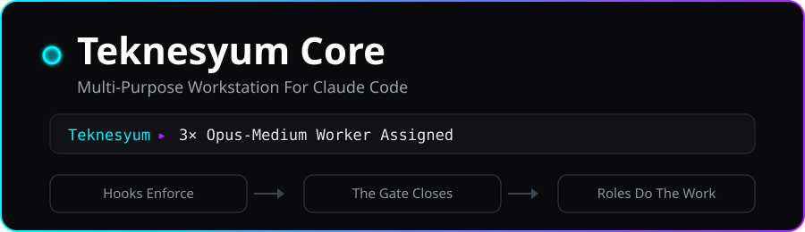
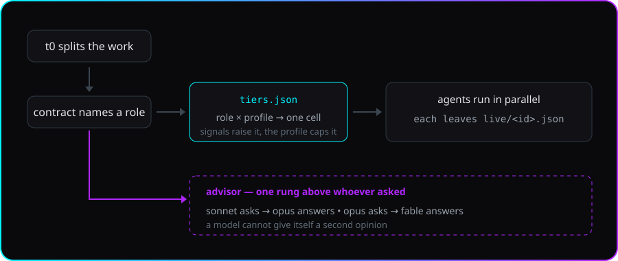
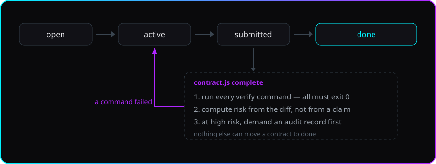
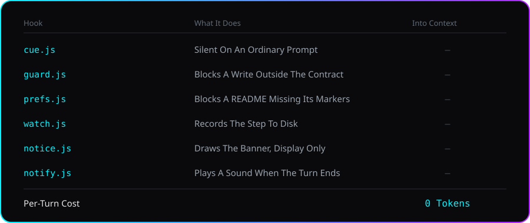

<!-- lang -->

[](README.tr.md)

<div align="center">

</div>

# Teknesyum Core

Multi-Purpose Workstation

---

## What is it

Teknesyum Core is a multi-purpose plugin for Claude Code. It splits big jobs into small
contracts: each contract declares which files it owns and how it proves it is done. Agents
run in parallel, every task gets a model that fits it, and no contract closes until its
verification commands actually pass.

It is the plugin I use to build my own applications, and it is shaped by that: everything
in it exists because a real project needed it. It will most likely keep getting updates for
as long as I keep building applications.

---

## Who does the work

`t0` is the session you are talking to. It does not write the code itself: it splits the job
into contracts and hands each one to an agent.

<div align="center">

</div>

Every agent is the same agent type. The role is a file it is told to read, so the role
descriptions do not sit in your context — only the agent holding a role pays for it.

| Role | What it does |
|---|---|
| `t0` | the session itself — splits the work, opens contracts, spawns the rest |
| `planner` | proposes the split: ids, owned files, verify commands. Writes no code |
| `builder` · `ui-builder` | writes what a contract asks for, only inside its `owns` list |
| `scout` | reads prior art before a project from scratch gets an architecture |
| `scribe` | mechanical work that carries no decision: renames, wording, inventories |
| `auditor` | verifies a high-risk contract independently, and may not write a single file |
| `advisor` | one question, one opinion, from a model one rung above whoever asked |

Which model each of them gets is not a choice you make per agent — the mode and the role
decide it together, and [the table](#the-agents) is below.

---

## Features

- **Right model for the job** — Simple tasks do not get the expensive model; nobody likes
  the bill. Role and profile pick the model and the effort together, and a run of failures
  raises both.
- **Risk-aware** — Risk is computed from the diff. When it is high the close demands an
  audit record, and that record has to name an agent that actually ran.
- **Role files** — Builder, planner, auditor, advisor. The role text is paid for by the
  agent holding it, not by your session.
- **Banner and statusline** — One line for what is happening right now. Not a dashboard.
- **A handoff note** — `.claude/relay/HANDOFF.md` says where the project stands: what is
  open, what closed last, which branch. A hook refreshes it when the session ends, so it
  costs nothing, and any model can read it — not only Claude.
- **Ask before you spawn** — `contract.js precheck` runs the verify steps first. If they
  already pass, the work is done and no agent is worth starting.
- **Acceptance that can fail** — A `verify` block where every step is `true`, `echo`, or a
  comment is not acceptance. The gate refuses to close on it and says why.
- **A ceiling** — A contract can name how many steps it is worth. Past it the contract stops
  being writable, so a run that is not converging stops on its own.
- **A pin you can go back to** — `precheck` records the tracked tree as `refs/teknesyum/<ID>`
  before the work starts; `revert` puts the owned files back to it.
- **Abandoned work is on the record** — A contract still `active` when the session ends is
  written to the ledger and shown on the statusline. Nothing is written into your context.
- **`doctor`** — One command answers whether the install is sound: versions, tier table,
  roles, hooks, statusline, and every close accounted for in the ledger.

---

## The three modes

Core runs in one of three modes — `eco`, `normal`, `premium`. The mode picks a column out of
the tier table, and the column decides which model and which effort each role gets.

| Mode | What it is for |
|---|---|
| `eco` | Long, cheap sessions. Haiku and Sonnet do the work; the advisor is available. |
| `normal` | Day to day. Sonnet builds, Opus plans and audits, no advisor. |
| `premium` | Work that has to be right the first time. Opus across the board, Fable as advisor. |

**You set the mode, and the plugin never changes it for you.** That is the design, not an
omission: consumption stays minimal when the ceiling is a decision you made. Signals can
raise a single cell inside the mode — a run of failures, high risk — but the mode caps them
and nothing raises the mode itself.

Pick one and run it:

```bash
node ~/.claude/plugins/cache/teknesyum/teknesyum-core/*/scripts/setup.js --profile eco
```

```bash
node ~/.claude/plugins/cache/teknesyum/teknesyum-core/*/scripts/setup.js --profile normal
```

```bash
node ~/.claude/plugins/cache/teknesyum/teknesyum-core/*/scripts/setup.js --profile premium
```

The mode is on the statusline, so you always know which one you are paying for. A single
repository can pin its own in `.claude/relay/config.json`.

---

## Install

### Windows — one line

```powershell
irm https://raw.githubusercontent.com/Teknesyum/Teknesyum-Core/v0.7.4/install.ps1 | iex
```

### macOS / Linux — one line

```bash
curl -fsSL https://raw.githubusercontent.com/Teknesyum/Teknesyum-Core/v0.7.4/install.sh | bash
```

**Restart Claude Code afterwards.** Hooks reload mid-session; the desktop client does not
redraw what they produce until it restarts. Everyone forgets this once.

Both one-liners point at a tag, never at `main` — what you pipe into a shell should be the
released script, not whatever the branch happens to hold today. Every release publishes the
SHA-256 of both installers.

**Needed:** Claude Code, git. **Optional:** Node.js. Without it the statusline and the gate
scripts do not run, and you get told so instead of left guessing.

The installers finish by running setup in your own terminal, where it asks its questions
for free. Skipped it? Run the script yourself:

```bash
node ~/.claude/plugins/cache/teknesyum/teknesyum-core/*/scripts/setup.js
```

**or paste this to Claude:**

> Set up Teknesyum Core. Run `node <plugin>/scripts/setup.js --check`, where `<plugin>` is
> the installed teknesyum-core directory. It prints JSON. Ask me every question under
> `missing` in a single message, then call `node <plugin>/scripts/setup.js --apply` with
> the matching flags. Do not write any config file yourself.

Setup writes `~/.claude/teknesyum/config.json` and wires the statusline. It applies at the
next session start.

---

## How it works

### The contract

A markdown file under `.claude/relay/contracts/`. A goal, the files it owns, the commands
that prove it.

```markdown
## Goal
The banner reads in the user's language.

## owns
core/scripts/statusline.js
core/strings.json

## verify
node test/all.js
```

`owns` lists files, not directories — a directory is a promise about files that do not
exist yet. It cannot name an absolute path or anything outside the project, and a contract
that owns a file nobody ever created cannot close: an unreadable file used to count as an
empty one, which let unwritten work through.

`verify` is the part that makes a contract closable at all. If the acceptance cannot be
written as a command that exits 0, the split is wrong, and the planner is told to say so
rather than invent a checkbox.

<div align="center">

</div>

### The gate

`contract.js complete` is the only thing that can close a contract. It runs the verify
commands itself instead of believing the report, and it works risk out from the diff rather
than from anyone's description of the change.

A contract climbs a ladder: `open`, `active`, `submitted`, `done`. Only a submitted contract
closes, and the archived file is stamped `done`, so nothing under `done/` still claims to be
in progress.

Three things also have to be true about the tree around it. Nothing else that is still open
may own a file this contract changed — otherwise whoever closes first seals work it never
did. No source file outside `owns` may be sitting modified, because the verify steps run
against the whole tree and would be testing changes the contract never claimed; documents do
not count, since they cannot change what a command returns. And a contract that names
`blocked-by: [T4]` does not close until `T4` is done. `contract.js list --ready` shows only
the contracts nothing is waiting on.

`contract.js reopen --reason "..."` takes a wrongly closed contract back with its round
raised; the closed round stays in the ledger, so reopening is a fact on the record and not
an erasure. Reopening stops at round six. A seventh round says the contract is wrong, not
that the agent is unlucky — split it, or narrow what it owns. `--force` is there for the day
you disagree.

Before any of that, `contract.js precheck --id X` runs the verify steps while the work is
still unstarted. If they already pass, the work is done and spawning an agent is a waste. It
also pins the tracked tree as `refs/teknesyum/<ID>` — a real ref, so gc cannot take it — and
`contract.js revert --id X --yes` puts the owned files back to that pin. The pin comes down
when the contract closes; an abandoned contract keeps its pin, which is the point of it.

A `verify` block whose every step is `true`, `:`, `exit 0`, `ls`, `echo` or a comment cannot
fail, and something that cannot fail is not acceptance. The gate refuses to close on it and
names the step. One command that can fail is enough; the rest may be noise.

Three quieter ways a seal could pass without measuring anything are closed too. A `verify`
written as one plain line instead of a list parses to zero steps, and zero steps always
pass; the gate now refuses it at submit and at close rather than sealing silence. A step
that exits zero after collecting no tests — `no tests ran`, `collected 0 items`, `Total
tests: 0` — is refused by the same rule: a filter that matches nothing is not a passing
suite. And two contracts cannot run their verify steps at the same time in one checkout,
because each would be measuring the other's half-written files; the second one is told who
is running and waits.

Rounds are the largest cost in the system. Measured over 124 sealed contracts, 54 of them
took at least one extra round — 72 rounds in total, each one a builder plus an auditor. So
`reopen` now demands `--critical "<what the seal let through>"`. Style, a better name, a
test you would also have liked: those are debt, written under `## Checkpoint`, not a reason
to pay for two more agents.

From the third round the same demand goes one step further: `reopen` refuses to open a round
without `--advisor <agent-id>`, and the id has to belong to a live record whose role is
advisor. A third round means two minds have now read the contract the same wrong way; the
cheapest thing at that point is a third one. The rule had been written down for a long time
and never once fired, because nothing asked for it. The ledger keeps who was asked.

When a contract owns a `.md` file, the gate runs `manset.js` over it before sealing: every
number in prose has to appear in a table, a list or a code block in the same section, or be
that column's sum. Numbers are produced by measurement and sentences are written afterwards,
and nothing had ever tied the two together — the single most repeated defect in the log. A
document that summarises something no table holds can opt out with `manset: off`.

A contract may carry `ceiling: <n>` — the number of tool steps it is worth. Past it the guard
stops accepting writes under that contract, so a run that is not converging ends without
anyone watching it. Contracts without the line get a generous default. When a session ends
with a contract still `active` and no agent holding it, the ledger gets a `stale` entry and
the statusline says so. It is a record, not a refusal to exit — the session closes as usual
and nothing is written into the model's context.

### The audit record

At high risk the close is refused until a record exists, and the record is bound four ways:

- to the **contents** of the files the contract owns, so a tree that moved after the audit
  no longer matches
- to **HEAD**, so a record written for another commit does not apply here
- to a **run-id that actually ran** — a live record on disk, whose role is auditor, and
  which wrote no files during the audit. The role is the one the agent was given in its
  prompt, not the type it was spawned as; every agent here is spawned as `worker`, so
  reading the type alone rejected auditors that had done the work. `audit --dry-run`
  answers whether an id can sign before the audit is paid for.
- to **one use**: the record is spent when the contract closes and cannot be replayed

Every close, every unmet close and every reopen is appended to `audits/ledger.jsonl`, and
`contract.js ledger` reports any contract sitting in `done/` that the ledger has never heard
of. The records are not chained to each other; each stands on its own bindings.

### The guard

`guard.js` runs in front of `Write`, `Edit` and `NotebookEdit`. It blocks a write to any
file outside the current contract's `owns` set — an agent binds itself to a contract by
touching it — keeps `audits/` and `live/` for the gate alone, and holds `contracts/done/`
read-only. `prefs.js` blocks a README or LICENSE missing its required markers, and exits
immediately when the author's preference file is absent, so for everyone else it does
nothing at all.

It reads shell commands for one thing only: work reaching `main` while a contract is still
open. It parses the command instead of searching it — heredocs are cut out first, so writing
a document that mentions `git push origin main` is not passing through the gate, and pushing
your own work branch is the normal step it never touches. A forced push to a protected
branch is refused even when the gate is deliberately open. `Bash` and `PowerShell` are both
in front of it; for a while only one of them was, which meant the check depended on which
shell the agent happened to pick. Nothing else about your commands is guessed at: that check
existed until v0.2.0 as plain-text matching, `cd` walked through it while a legitimate
one-liner reading the ledger was refused, and the guarantee lives in the record instead.

Outside a project with a relay, the gate falls open rather than closed. A hook that breaks
someone's unrelated repository is a worse failure than a missed check.

### The agents

The one agent type is `worker`, and the role arrives as a path in its prompt:

```
Read <plugin>/roles/builder.md and follow it.
Contract: .claude/relay/contracts/T7.md
```

Role and mode pick a cell out of [core/tiers.json](core/tiers.json); the cell is a model
and an effort.

| Role | `eco` | `normal` | `premium` |
|---|---|---|---|
| `t0` — the session itself | sonnet | opus | opus |
| `planner` | sonnet/medium | opus/medium | opus/high |
| `builder` · `ui-builder` | sonnet/low | sonnet/medium | opus/medium |
| `scout` | haiku/low | sonnet/low | sonnet/medium |
| `scribe` | haiku/low | haiku/low | sonnet/low |
| `auditor` | opus/medium | opus/medium | opus/high |
| `advisor` | opus/medium | off | fable/medium |

Signals raise a cell, the profile caps it, nothing lowers it.

| Signal | Effect |
|---|---|
| Two tool calls fail in a row | the effort goes up, then the model |
| Round 3 | the model goes up |
| Round 4 | the advisor is required, not offered |
| The change touches an irreversible path | the auditor opens |

The run of failures is counted per agent by a hook, so one agent's bad afternoon cannot
spend another agent's budget — and it acts on the second failure, because waiting for a
third is knowing better and doing nothing about it.

A project can pin its own profile in `.claude/relay/config.json`, so an `eco` repository
stays `eco` on a `premium` machine.

The **advisor** runs one rung above whoever asked: sonnet asks, opus answers; opus asks,
fable answers. A model cannot give itself a second opinion. There is no qualifying list —
wanting one is reason enough — and it gets the goal, the acceptance and the evidence, never
your draft answer.

### The cost

Every mechanism Claude Code offers gets classed by when you pay: **S** once per context,
**O** only when the feature runs, **C** every message forever, **Z** never. One rule falls
out of that table — on an ordinary turn, no hook writes into context.

<div align="center">

</div>

The chat banner rides on the `MessageDisplay` hook, which changes what is drawn without
touching what is stored or what the model sees. The binary's own words: *"Display-only: the
stored message and what the model sees are untouched."* Around 30 ms of node startup per
message, no tokens.

The band has a shape: one head line naming the workstation and at most two lines of work
above the answer, and at most one line below it. The closing line is not a repeat of the
opening one — it carries what changed while the answer was being written, or what is now
waiting on you, and stays empty when there is neither. The record it reads from is created
the moment a session spawns its first agent, not only when a contract is opened, so a
session that never writes a contract still gets its band.

The hooks that watch tool calls carry a matcher, so reading a file does not start a process.

### Tools that only run when called

| Script | What it does |
|---|---|
| `contract.js precheck` | runs the verify steps before an agent is spawned |
| `contract.js check` | risk, verify steps, and anything they name that is not there |
| `contract.js list` | what is open, and which contract owns a given file |
| `contract.js snapshot` | pins the tracked tree as `refs/teknesyum/<ID>` |
| `contract.js revert` | puts the owned files back to that pin |
| `handoff.js` | writes `.claude/relay/HANDOFF.md`, the state of the project |
| `doctor.js` | says whether the install is sound |
| `release.js` | decides the next version from notes left in `.changes/` |
| `update.js` | says whether a newer release exists |
| `map.js` | the import graph — hubs, cycles, orphans |
| `map.js who <file>` | who imports the file you are about to change |
| `log.js` | the error log; not written by hand |
| `setup.js` | machine setup and statusline wiring |

The handoff note is split in two. The mechanical half — open contracts with their status and
round, the last closes, the branch, the head, how much is uncommitted, which agents are stuck
— is refreshed by the session-end hook, so it costs nothing and is never out of date. The
other half is the one paragraph a machine cannot write, the intent, and a refresh preserves
it. The file is plain markdown, so the next model to open the project can read it whether or
not it is Claude.

`contract.js check` also reads the contract for references to things that do not exist: a
verify step calling a script nobody wrote is not acceptance, it is a step that cannot run,
and it is worth knowing before the work starts rather than at the gate. An `owns` entry with
no file behind it is reported as information — usually that is the work.

A newer release shows up as one dim word at the end of the statusline, and nowhere else —
not in the chat, not in the model's context. The lookup is a `git ls-remote` that runs at
most once a week, detached, while the session is already ending, so nobody waits for it.
It is a hint, not a guarantee: what it shows is true, but its silence does not prove you are
current. `node <plugin>/scripts/update.js` asks now and answers plainly.

The map stamps the commit it was built from. Three weeks later it would otherwise state
hubs, cycles and orphans that no longer exist, with full confidence. Instead the first lines
of `map.md` name the HEAD it was built at, the statusline says `map stale` the moment HEAD
moves past it, `doctor` says how many commits behind it is, and `map.js who` answers from a
live scan rather than from the stale file. A generated output is checked for freshness where
it is read, not where it is written; a silently stale answer is a wrong answer.

`map.md` is written to a size budget (`--budget=<bytes>`, 64 KB by default) and says in plain
words how many files it left out and where the rest are, instead of ending quietly. If a scan
finds less than half the files the last map had, it refuses to overwrite and says so - that is
what a wrong root looks like.

`doctor.js` answers in `{name, ok, message}` rows and takes `--json`. What it checks is what
it prints; run it rather than read about it.

---

## Doesn't native Claude Code already do this?

Some of it, yes: it spawns subagents, runs them in parallel, keeps a plan. Everything above
is what Core adds on top. The short version:

| | Native Claude Code | Teknesyum Core |
|---|---|---|
| Who decides "done" | the agent says so | `contract.js` runs the verify commands and refuses a close that fails them |
| Acceptance criteria | prose in a prompt | commands that must exit 0, and a block where every step is `true` or `echo` is rejected as no acceptance at all |
| Parallel writes | two agents can clobber one file | the guard blocks any write outside the contract's `owns` list |
| High-risk changes | no distinction | risk is computed from the diff; a high-risk close demands an audit record bound to the file contents, to HEAD and to an auditor that actually ran |
| A run that will not converge | keeps going | a contract may carry a `ceiling`, and past it the contract stops being writable |
| Going back | your own git discipline | `precheck` pins the tracked tree as a real ref; `revert` puts the owned files back |
| Work after the session ends | the plan is gone | contracts are files, and an abandoned one is written to the ledger |
| Model choice | you pick per subagent | role times mode picks the cell, and signals raise it |
| A second opinion | ask the same model again | the advisor runs one rung above whoever asked |
| Cost per turn | descriptions and rules ride in every message | 0 tokens; every hook writes to disk or to the screen, never to the context |

---

## What Core replaces, measured

You do not need to install anything alongside Core. That is a claim, so here are the numbers
behind it. Sixteen neighbouring projects were surveyed and two were put through a controlled
experiment on this machine; the table is what came back, not what we assumed.

| You might install | To get | What the measurement said | Where you land |
|---|---|---|---|
| A code-graph index — graphify, Aider's repo map, Serena | "what calls what" in a codebase | Five architecture questions on fastify (1,032 files): **63,462** tokens through the graph index, **56,120** through Core's `map.js`, **50,525** through plain grep. The same five answers. | `map.js` ships with Core. It builds 3× faster than the index and costs 74× less, because it never calls a model. |
| An Obsidian-style vault, wiki-links, a backlink plugin | project memory that survives the session | Four note layouts, one question set, **5/5 correct on all four**. The vault cost **+10%** tokens; the backlink index **+14%** and gave worse citations. No agent ever followed a wiki-link. | One flat `MEMORY.md` and one roadmap file. Nothing to install, nothing to sync. |
| An MCP orchestration suite | agents, swarms, task boards | One popular server publishes **358 tools**. Its schema is **~270 KB** and rides in *every* request — roughly **64–67k tokens** spent before a word of work — and it ships no completion gate. | Core's whole surface is scripts called on demand: **0 tokens** on an ordinary turn. |
| CodeQL or Semgrep | deep static analysis | CodeQL's licence does not allow databases built from a private repository. Semgrep's cross-file analysis is the paid tier. | Neither is something a plugin can hand you. Run them in CI if you need them. |
| A spec or PRD framework | acceptance criteria | Markdown ceremony that nothing executes. | Core's `verify:` steps are commands that must exit 0, and a step that cannot fail is rejected as no acceptance at all. |
| A memory-layer MCP | remembering across sessions | To be worth anything it has to read and write on every turn. | That is the one thing Core will not do. |

The honest summary of the index result: **an index buys precision, not tokens**, and only for
one class of question — *who calls this symbol*. If that is your daily question on a codebase
you have never read, install a graph tool for that job. It does not belong in your plugin
layer, where you pay for it on every session whether you ask it anything or not.

### What Core does not do

- **No symbol-level call graph.** `map.js` stops at file imports: hubs, cycles, orphans, edges.
- **No semantic search.** Grep and the import map, nothing embedded.
- **No cross-file taint analysis.**

On a codebase far larger than the ones this was measured on, or a foreign one you have never
opened, a dedicated index earns its cost. That is the moment to install one — for that job,
not forever.

---

## What it looks like in use

One line above and below each answer, saying the single most important thing happening. Not
a dashboard.

```
### Teknesyum ▸ Opus-High Auditor Assigned > T82 Audit In Progress
### Teknesyum ▸ 2× Opus Explorer · Sonnet-Medium Scout Assigned > Badge Text · Gate Design In Progress
### Teknesyum ▸ 3× Opus-Medium Worker Assigned
### Teknesyum ▸ Heads Up — 4 Tool Calls Failed In A Row
### Teknesyum ▸ 1 Contract Waiting At The Gate · 1 Contract Not Started
```

It is written as a markdown heading, so the client renders it as one and the eye finds it
without reading it.

While agents run, the line names each seat with its cell — `Opus-Medium Worker` is the role
and the model and effort it resolved to. Seats holding the same cell collapse into one
entry; that is where the `3×` comes from.

The seat comes first and the work after the `>`: who was assigned, then what is under way.
Where an agent is bound to a contract the work is that contract's own title, which stays true
long after the spawn; otherwise it is the description the agent was dispatched with. What
does not fit inside the line is dropped from the end, so the seats survive and the tasks
give way.

The tasks are listed, not paired off against the seats one by one: with two agents in the
same role, which task belongs to which seat is a guess, and the line does not pretend
otherwise. A spawn that carried no description at all says `Assigned` and nothing more — an
invented answer would be worse than none.

A run of failed tool calls beats everything else. The closing line reports what finished,
because it is computed after the message and simply knows more. Counters that only ever
grow — steps taken, logs open — were cut: a number with nothing to compare it against is
decoration.

---

## Commands

None. The entry point is the `relay` skill; everything else is a script, and the scripts are
in the table above.

---

## Layout

```
.claude/relay/
  contracts/           open work, one file per contract
  contracts/done/      closed work, stamped and archived
  audits/              records and ledger.jsonl
  live/                agent records, written by the hook
  config.json          this project's profile, if it pins one
  HANDOFF.md           where the project stands
  map.md               import graph
```

`node <plugin>/scripts/map.js` writes the import graph — hubs, cycles, orphans, edges. It
costs less to read than opening files, and answers things opening files does not.

---

## Tests

```bash
node test/all.js
```

2,540 assertions over the guard, the completion gate, the ladder, the audit record, the
ledger, the known bypasses, the tier and quota locks, the personal-convention gate, the
scaffold, the cue, the banner, the handoff note, and one check that no hook writes into
context. CI runs the same suite on Linux, Windows and macOS; development is Windows-first.

---

## Design notes

- [docs/COST-MODEL.md](docs/COST-MODEL.md) — where tokens go, and the rule that follows
- [docs/TRIAGE.md](docs/TRIAGE.md) — what came over from Teknesyum Base and what did not
- [docs/DECISIONS.md](docs/DECISIONS.md) — the decisions that shaped this, and why

---

## Contributing

Open an issue before writing code — it is faster than finding out your patch collided with
something. Keep the pull request small; a diff that does one thing gets read the same day,
a diff that does five gets read never.

The repository is written in English. Contributions land under AGPL-3.0-or-later, same as
everything else here; there is no CLA to sign and no ceremony to perform.

If it saves you time, you can [sponsor the work](https://github.com/sponsors/Teknesyum).

---

## Support

The plugin is free and stays free — AGPL, no paid tier, nothing kept back for a version you
have to buy. If it saved you a bad merge or an afternoon, sponsoring is one way to say so.

There are free ways to help too: report the bugs you hit, write down the criticism you have,
recommend it to a friend.

<!-- signature -->
<div align="center">

<a href="https://github.com/sponsors/Teknesyum"></a>
&nbsp;
<a href="LICENSE"></a>

</div>
