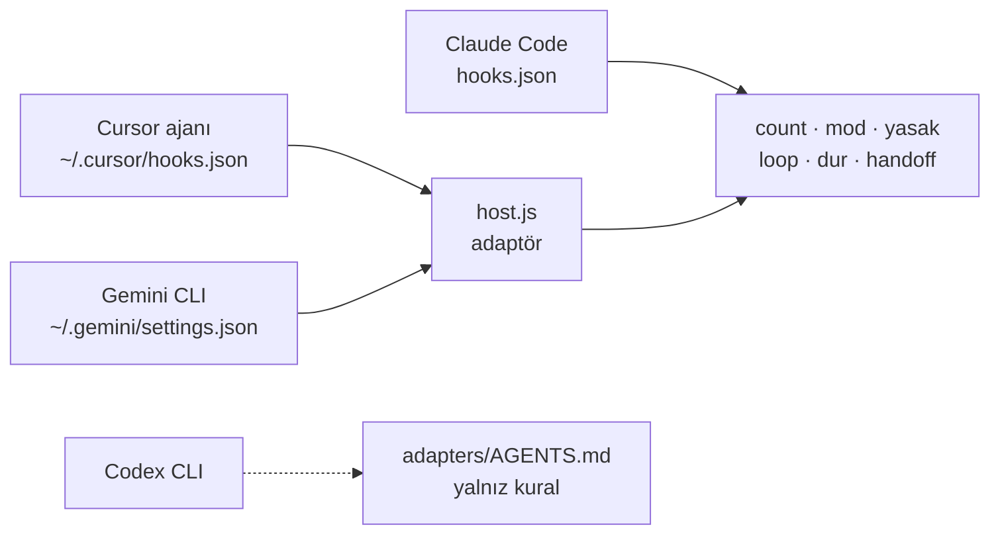
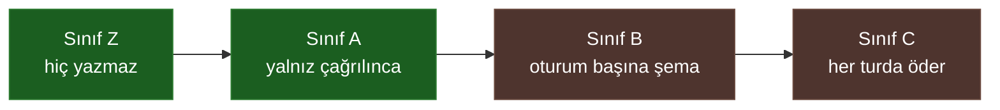
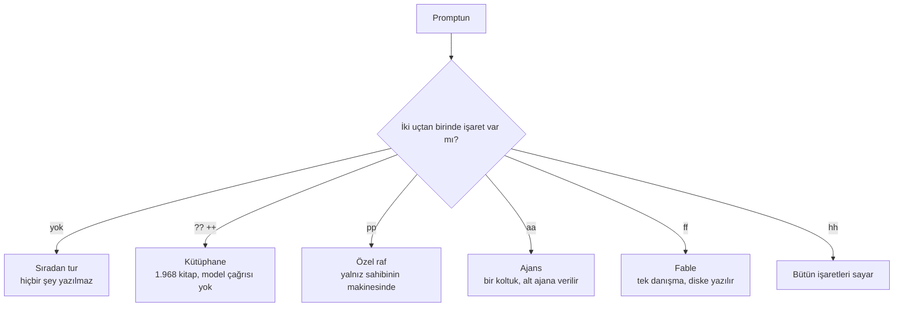
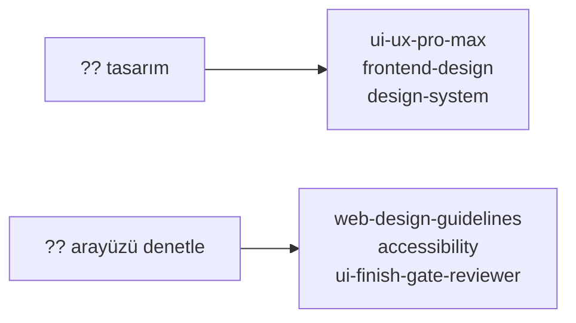
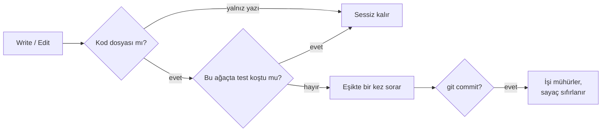
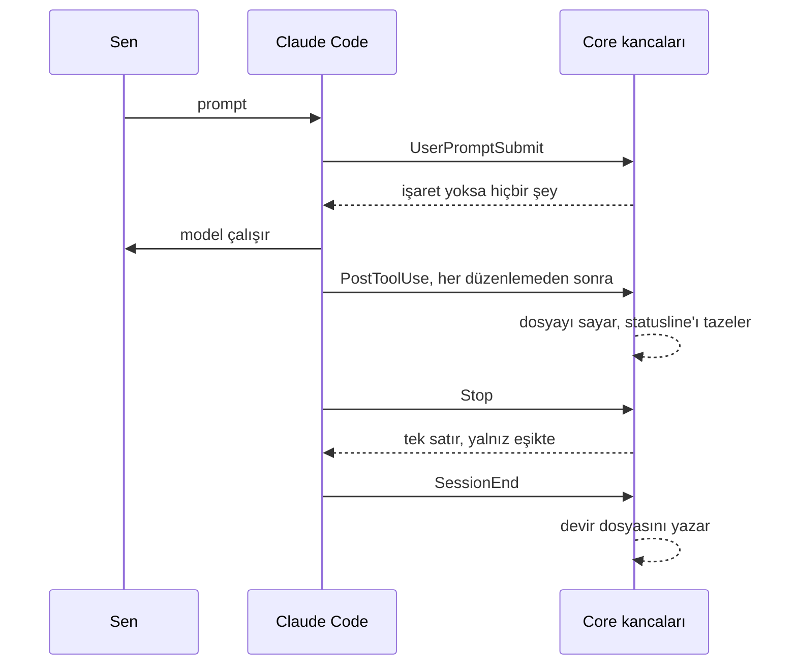

<!-- lang -->

[](README.md)

# Teknesyum Core

Sayar, Gösterir, Bir Kez Konuşur

---

## 0.33'te Yeni

0.26 ile 0.33 arasında altı şey geldi. Hiçbir şeyin olmadığı turda hiçbiri tek bayt
tutmuyor, her biri test takımında.

### Tek Çekirdek, Dört Host

Core bir Claude Code eklentisiydi. Hâlâ öyle; artık aynı kancalar Cursor'un kendi ajanında
ve Gemini CLI içinde de koşuyor. `core/hooks/host.js` ince bir adaptör: hostun kanca
JSON'unu Claude şemasına çevirir, aynı sayım, yasak liste, döngü, iş ve devir kodunu çağırır,
cevabı geri çevirir. Tek depo, tek sürüm, tek test takımı.



`setup.js --host cursor` ya da `--host gemini` yalnız kendi girdilerini bağlar, dosyadaki
başka her şeyi korur; `--remove` onları geri çıkarır. Codex CLI'nin Windows'ta henüz kancası
yok, kuralları metin olarak alıyor. Gemini 0.58.0 üstünde canlı koşuldu: hard reset reddedildi,
banner göründü, iş kapısı turu bir kez tuttu ([kayıt](docs/raporlar/gemini-canli-deneme.md)).

### Bedava Banner

Bir kanca iş yapınca tek satır görürsünüz: `Teknesyum Core > Yasak Liste Bir Komutu Durdurdu`.
Claude Code'da kanca satırı diske kuyruğa yazar, `bant.js` onu `MessageDisplay` ile cevabın
üstüne çizer; saklanan mesaj ve modelin bağlamı onu hiç görmez. Gemini'de aynı satır
`systemMessage` ile gelir; Gemini onu size gösterir, modele göndermez. Cursor'da reddedilen
kabuk komutunda görünür.

### Her İş, Bu Turda

Beş işli bir istem eskiden kırkıncı araç çağrısı civarında birini kaybederdi. Artık model
işleri `.claude/jobs.md` içine `- [ ] iş` diye yazar, her birini `- [x]` diye işaretler; bir
işi yalnız gerekçeyle açık bırakabilir: `- [ ] iş — senin kararını bekliyor`.

`Stop`'ta `dur.js` gerekçesiz açık satır varsa ya da istem bir listeydi ve liste yazılmadıysa
ya da istemdeki maddeden az satır yazıldıysa turu bir kez tutar. Sonraki istemde açık satırlar
deftere geçer, dosya `trash/`'e gider. Arka plan görev bildirimi istem değildir, hiçbir şey
götürmez.

### Ertelenen Her Şey İçin Tek Defter

Ertelenen her şey `.claude/acik.md`'ye `- [ ] iş — zaman — gerekçe` olarak gider; `sonra.md`
kalkar. Defteri kancalar yazar: `mod.js` `jobs.md`'nin açık satırlarını taşır, `ust.js` her
Agent çağrısına `- [ ] ajan: <açıklama>` açar, eski `.claude/sonra.md` bir kez taşınıp
`trash/`'e gider. Açık satır oldukça defter her istemde ve her `SessionStart`'ta (startup,
resume, compact) en çok 12 satır ve 600 karakterle gelir; `[x]` satırlar
`trash/acik-<zaman>.md`'ye budanır. Defter göründüğünde yaptığını `[x]` işaretle, yapmadığına
gerekçe yaz; gerekçesiz satır silinmez. Açık satır varken 40 karakteri geçmeyen yanıt `Stop`'ta
bir kez tutulur. Boş defterin maliyeti sıfır.

### "Bitti"den Önce Kanıt

Kod düzenleyip hiçbir şey koşmayan oturum `Stop`'ta bir kez tutulur: koş, çıktıyı göster.
Aynı ağaç ikinci kez sorulmaz, commit sayacı sıfırlar.

### Gerekçeli Yasak Liste

Her kabuk çağrısından önce yıkıcı komut, yerine ne yapılacağını söyleyen tek satırla
reddedilir: çalışma klasörünün dışına çıkan silme, disk yazma, force push ve hard reset, depo
ve sürüm silme, indir-koş boruları, `chmod 777`, makine çapında durdurma. Proje içinde silmek
serbest.

### İki Uçta İşaret

`??` `++` kütüphane, `pp` özel raf, `aa` ajans, `ff` fable danışma, `mc` bellek taraması,
`hh` yardım. Her biri istemin başında da sonunda da okunur; `hh` hepsini örnekle listeler.
`hh` listesi ekran kanalına çizilir: bağlama tek harf gitmez, basılıp basılmayacağına
model karar vermez.

| Özellik | Sıradan tur | İş yapınca | Kapatmak |
|---|---|---|---|
| Banner | 0 token | 0 token, yalnız ekran | - |
| İş kapısı | 0 bayt | `Stop`'ta bir blok | `jobs: false` |
| İş geri verme | 0 bayt | açık satırlar, sonraki istemde | `jobs: false` |
| Kanıt kapısı | 0 bayt | `Stop`'ta bir blok | `evidence: false` |
| Yasak liste | 0 bayt | reddedilen komut başına bir gerekçe | - |
| Host adaptörleri | 0 bayt | Claude Code'dakiyle aynı | `setup.js --host <h> --remove` |

Anahtarlar `~/.claude/teknesyum/config.json` içinde.

---

## Tarama

Buraya neyin gireceğini tahmin etmedik. Piyasayı okuduk.

| | |
|---|---|
| Bakılan depo | 1.000 |
| 45 Opus ajanıyla baştan sona okunan | 963 |
| Kütüphaneye alınan | 93 |
| Fikir notu olarak tutulan, konmayan | 165 |
| Reddedilen | 705 |
| Bugün gelen raf | 38 |
| Kataloğdaki kitap | 1.968 |

Hiçbiri kurulu değil. Katalog diskte bir dosya, modelsiz aranıyor; sıradan bir turun
bağlamına hiçbir raf girmiyor.

---

## Önce Sayılar

Aşağıdaki her iddia düz Claude Code'a karşı aynı koltukta (sonnet, düşük efor), temiz
config ile 2026-09-05 ve 2026-09-06'da ölçüldü. Yöntem, tablolar ve ham satırlar
[bench/rapor.md](bench/rapor.md) içinde; bench'in tamamı yaklaşık 40 $ tuttu.

| Ne ölçüldü | Düz Claude Code | Core 0.16 |
|---|---|---|
| Sıradan tur, kancaların bağlama yazdığı bayt (200 tur) | 0 | 0 |
| Sıradan tur, tur başına ek token, p50 / p95 | - | +207 / +427, tamamı cache okuması, 0,0001 $ |
| Görev 02-05, medyan maliyet, beşer koşu | 0,11-0,39 $ | %3 içinde ya da daha ucuz, hepsi geçti |
| Görev 06, dört dosya ve ~185 satır, üç koşu | 0,34 $, 3/3 geçti | 0,37 $, 3/3 geçti, kanca 3/3 sustu |
| Kancanın konuştuğu tek satır, konuştuğunda | - | ~450 token, 0,0007 $, ek araç çağrısı yok |
| Devam: altı turda kesilen oturum, sonraki oturum yalnız "devam et" | 0/3 bitirdi | 3/3 bitirdi; ikinci oturum 0,33 $'a 0,11 $ |
| Sökülen 0.15 makinesi olduğu gibi geri takıldı | - | 4-8 kat maliyet, 7-15 ajan çağrısı, aynı kabul |
| Sökülen her 0.15 parçası tek başına geri takıldı | - | taban aralığının içinde ya da üstünde, kabulün görebildiği hiçbir şey yok |

Tablo Core 0.16.0 üzerinde ölçüldü; kanca yüzeyi v0.16.1'de ve v0.24.0'a kadar yeniden değişti (`count.js`, `handoff.js`, `mod.js`, `loop.js`), tablo yeniden ölçülmedi. v0.39.0'dan beri Bash, Agent ve Stop olaylarının her biri tek node süreci çalıştırır.

Tek nefeste: hiçbir şeyin olmadığı turda Core'un bedeli sıfır. Görevde Core, düz Claude
Code ne tutuyorsa onu tutuyor. Satın aldığı tek şey kesilip yeniden alınabilen oturum;
para oraya gidiyor, çünkü ikinci oturum "iyi görünüyor" demek yerine işi yapıyor.

Son iki satır tasarımın kanıtı. Önceki sürüm çok ajanlı işi sözleşmelerin, rollerin ve
katmanların arkasına alıyordu. Olduğu gibi geri takılınca aynı görevleri dört-sekiz kat
fiyata geçti. Karar kuralı koşudan önce yazılıp parça parça geri takılınca hiçbir parça
kabul sütununu oynatmadı, hiçbiri geri girmedi. Satırlar raporun 8. bölümünde; varyantlar
`bench/varyant/` altında, tek komutla yeniden koşar.

---

## Büyük Araçlar Neden Konmadı

Hepsi okundu. Hiçbiri kötü olduğu için elenmedi; her biri, hiçbir şeyin olmadığı bir turda
ne tuttuğu için elendi.

| Araç | Neden burada değil |
|---|---|
| [Obsidian](https://obsidian.md) | Deponun yanına koca bir not kasası. Ondan ihtiyacımız olan tek şey bir devir dosyasıydı; o da `handoff.js`. |
| [graphify](https://github.com/hongkongkiwi/graphify) | Büyük kod tabanında çok iyi, hâlâ öneriyoruz. O indeksler; biz her oturumda indeks istemedik, `map.js` yalnız çağrılınca koşuyor. |
| [Context7](https://context7.com) | İstendiğinde canlı belge. Tasarımı gereği tur başına bağlam maliyeti; bizim kuralımız sıradan turun bedava olması. |
| [superpowers](https://github.com/obra/superpowers) | En geniş skill çatısı. Kendi lab rafı bizim kütüphanemizde; çatının kendisi her oturumda bağlamda şema tutuyor, yapmadığımız tek şey o. |

Z ile C arasındaki çizgi eklentinin tamamı: Z hiç yazmaz, A yalnız çağrılınca yazar, B
oturum başına şema tutar, C her turda öder. Core Z ve A gönderiyor. Üstünde hiçbir şey yok.



Yeşil Core'un gönderdiği. Kahverengi reddettiği.

---

## Nedir

Teknesyum Core, sıradan tura hiçbir şey eklemeyen bir Claude Code eklentisidir. Oturumun
dokunduğu dosyaları sayar, sayıyı statusline'da gösterir ve sohbete tam bir kez konuşur:
iş eşiği aştığında ve diskte plan yoksa. Oturum bittiğinde ya da bağlam penceresi
dolduğunda bir devir dosyası yazar; bir sonraki oturum iki kelimeyle sürer: "devam et".

Claude Code'un native yaptığı her şey - alt ajanlar, worktree'ler, plan modu, kancalar,
statusline - olduğu gibi bırakılır. Hiçbir şey sarılmaz, kapıya alınmaz, yeniden yazılmaz.

Aynı kancalar ince bir adaptörle Cursor'un kendi ajanında ve Gemini CLI'de koşar; Codex CLI
kuralları metin olarak alır. Bkz. [Diğer Hostlar](#cursor-gemini-codex-ve-diğer-hostlar).

---

## Ne Yapar

### Sayar

Her `Write`, `Edit` ve `NotebookEdit` sonrası kanca dokunulan dosyayı kaydeder ve git'e
kaç satır değiştiğini sorar. Eşiğin altında hiçbir şey yazmaz: bağlama sıfır bayt.

Eşik beş dosya, ya da izlenen dosyalarda yüz elli değişen satır, ya da yolu riskli görünen
tek bir dosya: `migrations/`, `auth`, `secur`, `config`, bir lock dosyası, `.github/`,
bir `Dockerfile`. Yeni dosyaların satırları gösterilir ama satır eşiğine girmez; üç yeni
dosya yazan iş plan isteyen iş değildir. Eşik aşıldığında ve `docs/plan.md` yoksa oturumda
bir kez tek satır gelir:

> 5 dosyaya dokunuldu ve plan yok. docs/plan.md yaz ya da atla de.

Konuşmanın tamamı bu. Model planı yazar ya da atla der; kanca bir daha sormaz.

### Gösterir

Statusline aynı durumu okur: dokunulan dosyalar eklenen ve silinen satırlarla, plan var mı,
oturumun koştuğu testler ve kaçının düştüğü, bağlam yüzdesi, bekleyen devir var mı, açık
hata günlükleri, varsa kanca hataları. Test bayatlığı state'teki son düzenleme zamanından okunur; git en çok on saniyede bir çalışır. Düz metin; burada renk ya da ölçü uydurulmaz.

Bir kanca iş yapınca kullanıcı sohbette tek satır görür: `Teknesyum Core > Kütüphane Döndü · 3
Kitap Uydu · En Çok Üçü Okunacak`, cevabın üstünde blok olarak. Kanca satırı diske kuyruğa
yazar, `bant.js` onu `MessageDisplay` ile çizer; bu olay yalnız ekranı değiştirir, saklanan
mesaj ve modelin bağlamı aynı kalır, satır token tutmaz. Oturum açılışı, işaretler, eşik,
kanıt kapısı, yasak liste, koltuk okuma ve iş listesi birer satır basar.

Oturumun kabuk üzerinden başlattığı ve otuz dakikadan uzun süredir çalışan süreçleri de
sayar: `⏳ 2 süreç 40 dk`. Sayımı ayrık bir süreç en çok dakikada bir tazeler, statusline
onu hiç beklemez; ilk takılı süreç göründüğünde zil bir kez çalar. Hiçbir şey durdurulmaz;
doksan dakikalık iş doksan dakika alabilir, satır yalnız hâlâ orada olduğunu söyler.

### Sınırlar

Her `Bash` ve `PowerShell` çağrısından önce kanca üst sınırı olmayan bekleme döngüsü arar:
`sleep` çevresinde `until` ya da `while`, `timeout` yok, sayaç yok, son tarih yok. Böyle bir
döngü beklediği şey gelmezse sonsuza kadar asılı kalır. Çağrı, nasıl sınırlanacağını söyleyen
tek satırla reddedilir; sınırı model işten seçer ve yeniden koşar. Gerisi tek bayt yazılmadan
geçer.

### Devreder

Bağlam yüzde altmışı geçince ya da oturum bitince `.claude/handoff.md` makine tarafından
yazılır. Tek satır kuralla açılır - önce task'ı, sonra değişen dosyaları oku, ilk bitmemiş
parçadan sür, diff'in gösterdiğini yeniden yapma - ve sonra şunları taşır: `task`, oturumun
ilk istemi, transkriptten; `changed_files`, `git diff --stat`'tan; `tests_run`, kancanın
gördüğü komutlar, çıkış kodları ve o anın ağaç karması; `steer`, ilkinden sonraki son üç
istem; varsa `plan`. İki bölüm modele bırakılır, `decisions`
ve `next_action`; eşikte tek satır onları ister:

> Bağlam %64. .claude/handoff.md içinde decisions ve next_action doldur.

Yeniden üretilen devir modelin yazdığını korur. Sonraki oturum başında tek satır söylenir,
`Devam: .claude/handoff.md`, başka hiçbir şey. İş bitince dosya `trash/`e gider.

### Çalar

Claude sizi beklerken bir ses - izin sorusu, soru, diyalog - ve sizi gerektirmeyen her şey
için sessizlik. Tek ayarla kapanır.

### Danışır

`??` ya da `++` ile başlayan istem önce kütüphaneyi açar. `hooks/mod.js` kancası kelimeleri
`kutuphane.js find`e verir, model çağrısı yok; en çok sekiz bulgu ve üç satır kural o turun
bağlamına girer; model en çok üç kitabı lean okur, kaynağı tek satırda söyler ve o uzmanlıkla
çalışır. Türkçe kelimeler İngilizce kataloğa çevrilir, eşleşme tam kelimedir. `pp` ile
başlayan istem ise özel rafı açar: sahibin kendi kitapları, `~/.claude/teknesyum-private/private/`
altında, bütün (8 KB tavan), kullanıcıya `Teknesyum Core > Özel Raf Açıldı` satırıyla; raf yalnız o aynanın
uzak deposu sahibinse vardır, başka makinede `pp` bunu söyler ve durur. `aa` ile başlayan istem ajansı açar: kelimeler `agency.js find`e gider, en çok üç koltuk ve bir kural
bağlama girer; model koltuğu lean okur, soruyla birlikte Türkçe bir alt ajana verir, cevabı `docs/danisma/`
altına kaydeder. Sıradan tur hiçbirinden bir şey almaz.




### Yalnız çağrılınca çalışan araçlar

| Betik | Ne yapar |
|---|---|
| `scripts/map.js .` | Import grafiği: merkezler, döngüler, yetimler. `map.js who <dosya>` kimin import ettiğini söyler. |
| `scripts/log.js write` | Core'un `logs/openlogs/` klasörüne sabit biçimli kayıt: `--kind hata` (varsayılan), `yontem` (saklanacak yöntem) ya da `teklif` (öneri). `core'a raporla` ya da `report this to core` gibi bir istem tarifi yalnız o tura getirir. |
| `scripts/advice.js` | `ask --mod gorus --konu <slug> --girdi <dosya>` fable danışmasını `docs/danisma/` altında numaralar, kapıyı tek çağrı için kurar ve dosyayı gösteren tek satırlık Agent istemi basar; girdi bağlama iki kez girmez. `record --mod gorus --ajan <agentId>` cevabı, modeli, çıktı tokenini ve süreyi ajan kaydından okuyup dosyalar. `list` kayıtları gösterir. |
| `scripts/kutuphane.js` | Kütüphane: raflar projenin dışına klonlanır (`fetch`), katalog frontmatter'dan ya da ilk başlık ve paragraftan kurulur, `find <kelimeler>` modelsiz puanlar, `show <slug…> --lean` üç kitap ve 48 KB ile sınırlı, `record` `docs/danisma/` altına yazar, `push private` özel rafı commit'ler ve iter, `stale [gün]` her rafın kaç gün önce çekildiğini listeler, `fetch all --stale 7` yalnız ondan eskileri `fetch --depth 1` ve reset ile günceller, klonlar sığ kalır; `slim` mevcut her klonu bir kez sığlaştırıp çöp toplar. Otuz sekiz raf `core/kutuphane.json` ile gelir (1.968 kitap; MIT, Apache-2.0, CC0, CC BY-SA 4.0 ve bir CC BY-NC-SA 4.0; seçim `docs/kutuphane/` altında; 8 Eylül 2026 piyasa taraması, 1000 depo, 963 okundu, 93 Al, `docs/kutuphane/piyasa-2026-09-08.md`), `raf add <slug> <url> --kind agents|skills|prompts|docs` ekler; tür neyin kitap sayılacağını seçer. Hiçbiri kurulmaz, hiçbir raf bağlama girmez. |
| `scripts/agency.js` | [agency-agents](https://github.com/msitarzewski/agency-agents) deposu artık kütüphanenin `agency` rafı, komutlar aynı (`find` kendi puanlamasını kullanır, `show` ve `record` kütüphaneninkidir): `find ui` seçer, `show <slug> --lean` rolü kişilik ve ölçüt bloklarını atarak alt ajana verir, `record` alışverişi `docs/danisma/` altına yazar. `show` bir koltuk izi bırakır, sonraki `Stop` onu sohbette `Koltuk: <slug> okundu · <n> KB` diye basar; satır bağlama girmez. Hiçbiri ajan olarak kurulmaz; liste bağlama hiç girmez. |
| `scripts/manset.js` | Markdown raporu denetler: düzyazıdaki her sayı aynı bölümün tablosunda ya da listesinde bulunmalı. |
| `scripts/scaffold.js` | Lisans, imza bloğu, dil linki: modelin asla yazmadığı sabit metinler. |
| `scripts/setup.js` | Makine ayarı: dil, zil, özel depo, projeler klasörü. Statusline `~/.claude/teknesyum/` altındaki `bridge.js` kopyasını koşar; eski eklenti sürümlerinin budanması onu kırmaz. `--host cursor\|gemini` adaptörü o hosta bağlar, `--remove` çıkarır. |
| `scripts/doctor.js` | Sekiz kontrol: node, git, sürüm, kancalar, statusline, önbellek, harita, günlükler. `cache` deponun kancalarını, betiklerini ve metinlerini kurulu eklentiyle karşılaştırır, henüz canlı olmayan her dosyayı adıyla basar. |
| `scripts/scan.js` | Projenin kendisine sekiz salt okunur kontrol: lisans yüzeyleri, beş dosya eşiğine karşı plan, devir boşlukları, sürüme karşı belgeler, test betiği, `trash/` atıfları, `tmp/` dışında kalmış geçici dosyalar, harita. Yazmaz, model çağırmaz, bağlama taşımaz; profil yalnız belge kümesini genişletir. |
| `scripts/hatirla.js` | Bellek taraması: `topla [--gun N]` geçmiş her isteği kesmeden kanıtıyla — kapanış cevabı, sonraki isteğe kadarki commit'ler, `trash/jobs-*`, `.claude/jobs.md` ve `docs/plan.md` açık satırları — yaklaşık 40 bin karakterlik `tmp/gecmis-N.md` sayfalarına yeniden eskiye yazar, tekrarlanan istek bir kez. Dönemin bütün commit listesi `tmp/gecmis-commitler.md` dosyasına gider. Yalnız dizin basar; her sayfa sonnet'e yoluyla, 4'erli paralel gruplar ve tek birleştiriciyle gider. Her istek maddelerine bölünür, her madde o isteğin ve sonraki bütün isteklerin kapanışı ve commit'leriyle sınanır. `record --ajan <agentId>` raporu `tmp/hatirlatici.md` olarak dosyalar — istek başına ne dedim, sonra `[x]` yapıldı, `[ ]` yapılmadı, `[!]` kararını bekliyor, `[?]` belirsiz — ve tam bitmemiş olanların hepsini 0 tokenle ekrana basar; ikinci kayıt ekrandaki ilkinin yerine geçer. Geçici dosyalar `tmp/` altında durur, git'e girmez. |
| `scripts/cop.js` | `<proje>/trash` klasörünü ölçer: `node cop.js .` toplamı ve en büyük on dosyayı basar, 100 MB üstünde `1` ile çıkar. `--sil` klasörü geri dönüşüm kutusuna gönderir. Bu bayrak olmadan projede hiçbir şey silinmez. Günde bir kez oturum açılışında `~/.claude/teknesyum/` altındaki yedi günden eski state, banner ve advice dosyalarını süpürür (etkin oturumunkini değil); eklenti önbelleğinde kurulu sürüm dahil en yeni iki Teknesyum sürümü dışındakileri `~/.claude/teknesyum/trash/plugin-cache/` altına taşır. |
| `scripts/release.js` | Sürümü `.changes/` altındaki notlardan artırır, kurulum satırlarını yeniler, etiketler; `publish` GitHub sürümünü `vX.Y.Z` başlığıyla açar, iki kurucuyu `.sha256` dosyalarıyla yükler. |

---

## Tasarım Ve Arayüz Denetimi

Tasarlamak ile tasarımı denetlemek ayrı iki iş, kütüphane ikisini de taşıyor. Piyasanın
ikinci taramasından sonra bunun için beş raf eklendi.

| Raf | Ne işe yarar |
|---|---|
| `ui-ux-pro-max` | Tasarlarken: 67 stil, 96 palet, 57 font eşleşmesi, 13 yığın. |
| `anthropic-skills` | Tasarlarken: `frontend-design`, `brand-guidelines`, `canvas-design`; Anthropic'in kendi deposu. |
| `addyosmani-skills` | İkisinde de: `frontend-ui-engineering` erişilebilir ve duyarlı arayüz kurar, erişilebilirlik listesi onu denetler. |
| `react-best-practices` | Denetlerken: `web-design-guidelines` bitmiş arayüz kodunu Web Interface Guidelines'a göre okur. |
| `pair-design` | Tasarlarken: kullanıcıya değil kullanıcıyla tasarım yürütme çerçevesi. |

Zaten duranların yanına — `refactoring-ui`, `web-design`, `ecc/skills/design-system`,
`ecc/skills/accessibility`, ajansın `design` koltukları. Hiçbiri kurulu değil; `?? tasarım`
ya da `?? arayüzü denetle` bulur, sıradan tur hiçbirini görmez.



---

## Ne Çıktı

0.16 bir çıkarma sürümü. Şunlar eklentiden çıktı; hepsi `v0.15.0` etiketinde duruyor,
`bench/varyant/` ölçtüğü her parçanın kaynağını oradan adlandırıyor:

- sözleşme makinesi: `contract.js`, `risk.js`, `verify-runner.js`, relay'in `handoff.js`'i;
- dokuz kanca: autoclose, closure, cue, embed, guard, notice, schema, seal, watch;
- altı rol metni, `worker` ajanı, relay skill'i, `tiers.json`.

Yerine iki kanca geldi, `count.js` ve `handoff.js`, bir de aşağıdaki beş satırlık kural.
Ajanlar, worktree'ler ve plan modu yerinde; onlar Claude Code'un kendisinin ve model onları
her zamanki gibi kendi seçiyor. Çıkan parça, onun yerine seçen makineydi.

---

## Kurulum

### Windows - tek satır

```powershell
irm https://raw.githubusercontent.com/Teknesyum/Teknesyum-Core/v0.41.0/install.ps1 | iex
```

### macOS / Linux - tek satır

```bash
curl -fsSL https://raw.githubusercontent.com/Teknesyum/Teknesyum-Core/v0.41.0/install.sh | bash
```

**Sonra Claude Code'u yeniden başlatın.** Kancalar oturum ortasında yüklenir; masaüstü
istemci ürettiklerini yeniden başlamadan çizmez.

İki tek satır da bir etikete bakar, asla `main`'e değil. v0.24.0'dan itibaren her sürüm dört
asset taşır: `install.ps1`, `install.sh`, `install.ps1.sha256` ve `install.sh.sha256`; her
`.sha256` dosyası `<hex>  <dosya>` satırını tutar, `sha256sum -c` biçimi.

**Gereken:** Claude Code, git, Node.js.

Kurucular kendi terminalinizde setup'ı çalıştırarak biter. Atladıysanız kendiniz çalıştırın:

```bash
node ~/.claude/plugins/cache/teknesyum/teknesyum-core/*/scripts/setup.js
```

Setup `~/.claude/teknesyum/config.json` yazar ve statusline'ı bağlar. Sonraki oturum
başında geçerli olur.

### Cursor, Gemini, Codex Ve Diğer Hostlar

| Nerede | Ne çalışır |
|---|---|
| Herhangi bir editörün terminalinde `claude`, Cursor dahil | Hepsi. Düz Claude Code. |
| Cursor ya da VS Code içinde Claude Code eklentisi | Eklentiler ve kancalar CLI ile ortak; statusline orada görünmez. |
| Cursor'un kendi ajanı | Yasak liste, döngü sınırı, sayım, iş ve kanıt kapıları (tur başına bir takip mesajı), devir. Banner reddedilen komutta görünür. İşaretler ve iş geri verme, Cursor'un istem kancasında olmayan bir bağlam kanalı ister. |
| Gemini CLI | Statusline dışında hepsi: `systemMessage` ile banner, işaretler, yasak liste, kapılar, devir. 0.58.0 üstünde canlı koşuldu. |
| OpenAI Codex CLI | Yalnız kural, [adapters/AGENTS.md](adapters/AGENTS.md)'den; kancaları deneysel ve Windows'ta yok (v0.114). |

Cursor ve Gemini için yalnız Node.js ve Core'un bir kopyası gerekir; Claude Code şart değil.
Klondan bağlayın, çünkü eklenti önbelleğinin yolu her güncellemede değişir:

```bash
git clone --depth 1 --branch v0.41.0 https://github.com/Teknesyum/Teknesyum-Core "$HOME/Teknesyum-Core"
```

```bash
node "$HOME/Teknesyum-Core/core/scripts/setup.js" --host cursor
```

İki satır da bash'te ve PowerShell'de olduğu gibi koşar. Gemini CLI için `--host gemini`,
girdileri geri çıkarmak için `--remove` ekleyin. Sonra hostu yeniden başlatın. Ardından
[adapters/AGENTS.md](adapters/AGENTS.md)'deki bloğu projenin `AGENTS.md` (Cursor) ya da
`GEMINI.md` (Gemini) dosyasına yapıştırın; model kapının istediği iş listesini böyle bilir.
Token tutan tek parça o blok, tur başına yaklaşık 150.

Cursor kullanıcısının ajanına verilecek hazır istem
[docs/kurulum/cursor-prompt.md](docs/kurulum/cursor-prompt.md) içinde.

---

## CLAUDE.md Kuralı

Eklenti modele nasıl çalışacağını söylemez. Kendi `CLAUDE.md`'nize koymanızı önerdiği beş
satırlık kural bu; sayım kancası tek yaptırımı, kuralın kendisi de yukarıdaki tablodaki tur
başına ~200 token.

```
- Tek dosya ve bildiğin iş: yap.
- Beş ve üstü dosya: önce docs/plan.md.
- Bilmediğin kütüphane: yazmadan önce oku.
- Bitince çalıştır, çıktıyı göster.
- Küçük iş: bunların hiçbiri.
```

İş listesi ve devirle uzun biçimi [adapters/AGENTS.md](adapters/AGENTS.md) içinde.

---

## Kullanımda Nasıl Görünür

```
Teknesyum ▸ my-app · bağlam %41 · 3 dosya +82-14 · plan yok · test geçti
Teknesyum ▸ my-app · bağlam %67 · 6 dosya +240-31 · plan · test bayat · devir
```

İlk satır her eşiğin altındaki bir oturum: modele hiçbir şey söylenmemiş. İkincisi planını
yazmış, testlerini koşmuş, sonra dosya değiştirmiş (son kayıt bayat) ve `decisions` ile
`next_action` satırlarını bekleyen bir devri olan oturum. Test sözcüğü yalnız son kayıttır:
çıkış kodundan geçti ya da kaldı, koşu hiçbir şey basmadıysa bilinmiyor, HEAD ya da çalışma
ağacı sonradan değiştiyse bayat.

---

## Kancalar




Yukarıdaki kanıt kapısı on üç kanca kaydından biri. Dokuz olay, on bir dosya, hepsi
`core/hooks/` altında:

| Olay | Kanca | Söyler |
|---|---|---|
| `SessionStart` | `count.js` | varsa `Devam: .claude/handoff.md`; varsa `docs/plan.md`nin ilk açık `- [ ]` adımı; `<proje>/trash` 100 MB'ı aştıysa proje başına günde en çok bir kez çöp teklifi — satır tam silme komutunu taşır, kanca çöpü kendi boşaltmaz; her kaynakta, compact dahil, `.claude/acik.md`'nin açık satırları; yoksa hiçbir şey. Günde bir kez `kutuphane.js fetch all --stale 7`yi arka planda ayrık başlatır, hiçbir raf bir haftadan eski kalmaz, ve `cop.js`'in eski state dosyası ve eski eklenti sürümü süpürmesini koşar; model hiçbirini görmez |
| `UserPromptSubmit` | `mod.js` | `??` / `++`de kütüphane bulguları, `pp`de özel kitaplar, `aa`da ajans koltukları, `ff`de fable danışma yordamı, `mc`de bellek tarama yordamı, `hh`de işaretlerin listesi (liste bağlama değil ekran kanalına gider) — işaret cümlenin başında da sonunda da okunur, `mc` başta yalnız tek başına ya da `2 hafta` gibi kapsamla sayılır; `.claude/jobs.md`'nin (iş listesi, `- [ ] iş — gerekçe`) ve eski `.claude/sonra.md`'nin açık satırları `.claude/acik.md` defterine geçer, dosya `trash/`'e taşınır, defterin `[x]` satırları `trash/`'e budanır, açık satırları bağlama eklenir; Core'a rapor isteyen istem (`core'a raporla`, `teknesyum'a bildir`, `report this to core`) `log.js write` tarifini alır; çok maddeli istem bağlama yazmadan durum işareti bırakır; yoksa hiçbir şey |
| `PostToolUse` | `count.js` | eşikte tek satır, bir kez; yoksa hiçbir şey |
| `PostToolUseFailure` | `count.js` | hiçbir şey; kalan test komutunu kaydeder |
| `PreToolUse` | `yasak.js` | tehlikeli komutu tek satır gerekçeyle reddeder. Proje içinde silmek serbest; dışına çıkmak değil — hedefi çalışma klasörünün dışına düşen ya da kökün kendisi olan silme, disk yazma, geçmiş silme, depo/sürüm silme, indir-koş boruları, `chmod 777`, makine çapında durdurma reddedilir; ardından aynı süreçte döngü kapısı: bekleme döngüsünün üst sınırı yoksa tek satır; yoksa hiçbir şey |
| `PreToolUse` | `ust.js` | tur, işi oturumun kendi modelinin üstündeki bir modele verdiğinde tek satır — çağrılan model ve işin ne olduğu. Oturumun kendi modeli dökümün sonundan okunur; aynı ya da alt model, model adı geçmeyen çağrı ve istem anında zaten duyurulmuş danışma susar. Aynı süreçte kurulmamış, harcanmış ya da yol satırından uzun fable danışmasını reddeder; modele hiçbir şey gitmez |
| `Stop` | `dur.js` | Arayüz kapısı: bu tur bir `.tsx` `.jsx` `.vue` `.svelte` `.css` `.scss` `.less` `.html` `.axaml` ya da `.xaml` dosyasını düzenlediyse ve son düzenlemeden sonra ekran görüntüsü alınmadıysa tur bir kez durdurulur; en küçük boyutta görüntü, işi yapmamış bir alt ajanın bakışı ve "çalışıyor" ile "kullanılabilir" iki ayrı iddia istenir; masaüstü projede (`src-tauri/`, Electron, XAML) tarayıcı görüntüsü sayılmaz. Kapatmak: `ui: false`. Ayrıca aynı süreçte, cevap `Kullanılan kitaplar:` / `Books used:` satırıyla bitiyorsa onu gerçekten okunan kitaplarla karşılaştırır, fark varsa `Kitaplar Uyuşmuyor · Beyan … · Okunan …` satırını kuyruğa koyar; count'un Stop işi: diff'i tazeler, `agency.js show` sonrası koltuğu bir kez sohbet satırı olarak basar. Sonra dosya düzenleyip hiçbir şey koşmayan oturum bir kez durdurulur; aynı ağaç ikinci kez sorulmaz. Kapatmak: `evidence: false`. İş kapısı aynı bloğu paylaşır: `.claude/jobs.md`'de gerekçesiz açık satır, liste yazılmamış ya da eksik yazılmış çok maddeli istem, ya da `.claude/acik.md`'de açık satır varken 40 karakteri geçmeyen yanıt turu bir kez tutar. Kapatmak: `jobs: false` |
| `SessionEnd` | `handoff.js` | hiçbir şey; devri yazar |
| `Notification` | `notify.js` | hiçbir şey; çalar |
| `MessageDisplay` | `bant.js` | hiçbir şey; kuyruktaki `Teknesyum Core > …` satırlarını yalnız ekrana çizer. Mesajın son parçasında turu konuşma kaydından okur ve cevabın altına `Kullanılan Kitaplar · …` ekler: çağrılan skill'ler, özel raftan, kütüphaneden ya da bir skill klasöründen okunan dosyalar, `kutuphane.js show` adları; kitapsız tur hiçbir şey çizmez, aynı liste iki kez çizilmez |

Bağlama yalnız `count.js` ve `mod.js` yazabilir; test takımı başkasının yazmadığını denetler. Ölçüm: sıradan tur 0 bayt, `??` ~1,7 KB, `pp` ~3,7 KB, `aa` 1 KB altı.

Onuncu dosya `host.js` Claude Code'a hiç bağlanmaz. Cursor ve Gemini onu `host.js <host> <olay>`
diye çağırır; yalnız `count.js` ve `mod.js`'in söylediğini aktarır, takım bunu da denetler.

Bir tur, baştan sona:




---

## Düzen

```
.claude/
  handoff.md           iş nerede kaldı, makine yazar, iki satır sizin
  acik.md              defter: ertelenen açık satırlar, makine yazar, model işaretler
  jobs.md              turun iş listesi, sonraki istemde deftere geçer, sonra trash/
  map.md               import grafiği
adapters/
  AGENTS.md            Codex, Cursor ve Gemini için metin olarak kurallar
docs/
  plan.md              kancanın istediği plan, istediğinde
  danisma/             danışma kayıtları
bench/
  rapor.md             yukarıdaki tablonun arkasındaki rapor
  varyant/             çıkan parçalar, yeniden ölçülmeye hazır
~/.claude/teknesyum/
  config.json          sizin ayarınız
  state-<oturum>.json  sayım
  hook-errors.log      bir kancanın yapamadığı
```

---

## Testler

```bash
npm test
```

Takım gerçek kancaları geçici bir depodan geçirir: sayım eşiğin altında susar ve sıfır bayt
yazar, üstünde bir kez konuşur, riskli yolu tek başına sebep sayar, diskte plan varken
susar. Devir git'ten üretilir, modelin yazdığını korur, sonraki başlangıçta duyurulur ama
sıkıştırmadan sonra duyurulmaz. Yanında: iki dilde statusline, kişisel kural kapısı,
scaffold, harita, zil, doctor ve bench'in kendi maliyet ve koşu yardımcıları.

Kapılar da aynı yoldan geçer: yasak liste ve döngü sınırı, kanıt kapısı, iş kapısı ve geri
vermesi. Host adaptörlerinin kendi takımı var: Cursor ve Gemini olayları girer, host cevabı
çıkar; setup bağlamasının iki kez koşunca aynı kaldığı ve yabancı kancalara dokunmadığı
denetlenir.

---

## Tasarım Notları

- [docs/COST-MODEL.md](docs/COST-MODEL.md) - token nereye gidiyor ve ondan çıkan kural
- [docs/DECISIONS.md](docs/DECISIONS.md) - bunu biçimlendiren kararlar ve nedenleri
- [docs/BENCH.md](docs/BENCH.md) - eklenti düz Claude Code'a karşı nasıl ölçülüyor

---

## Katkı

Kod yazmadan önce issue açın - yamanızın bir şeyle çakıştığını sonradan öğrenmekten hızlı.
Pull request'i küçük tutun; tek iş yapan diff aynı gün okunur, beş iş yapan hiç. Yeni
özellik `bench/varyant/` altında bir girdi ve satırlarıyla gelir; çıta en üstteki tablo.

Depo İngilizce yazılır. Katkılar AGPL-3.0-or-later altında iner, buradaki her şey gibi;
imzalanacak CLA, yapılacak tören yok.

Zaman kazandırdıysa [çalışmayı destekleyebilirsiniz](https://github.com/sponsors/Teknesyum).

---

## Destek

Eklenti ücretsiz ve ücretsiz kalıyor - AGPL, ücretli katman yok, satın almanız gereken bir
sürüm için saklanan hiçbir şey yok. Kötü bir merge'den ya da bir öğleden sonradan
kurtardıysa, sponsor olmak bunu söylemenin bir yolu.

Ücretsiz yardım yolları da var: çarptığınız hataları bildirin, eleştirinizi yazın, bir
arkadaşa önerin.

<!-- signature -->
<div align="center">

<a href="https://github.com/sponsors/Teknesyum"></a>
&nbsp;
<a href="LICENSE"></a>

</div>
