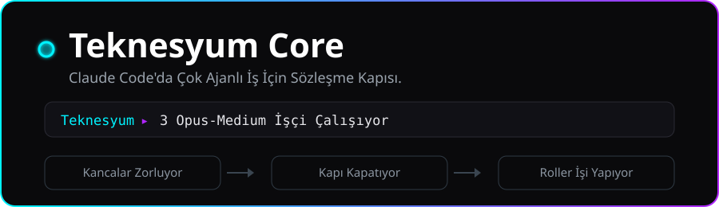
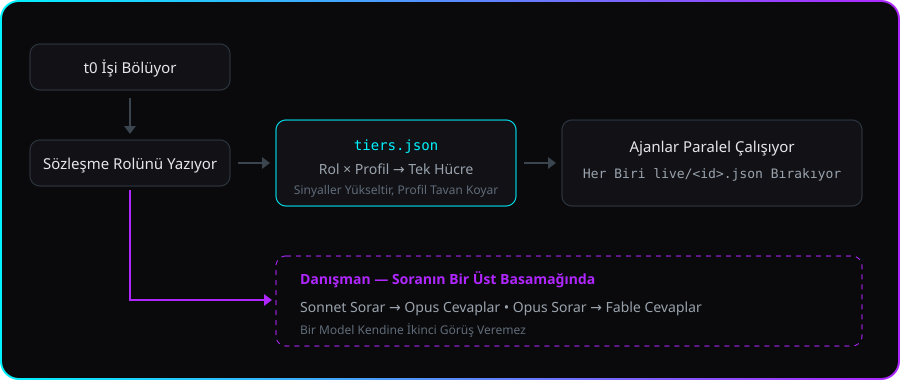
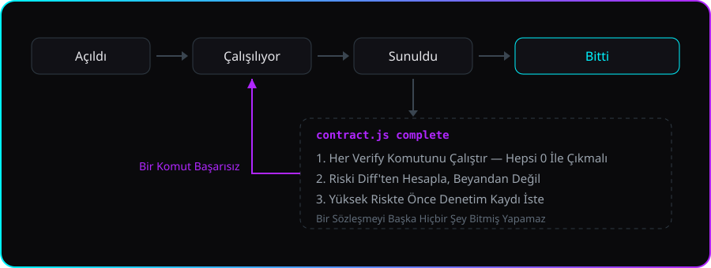
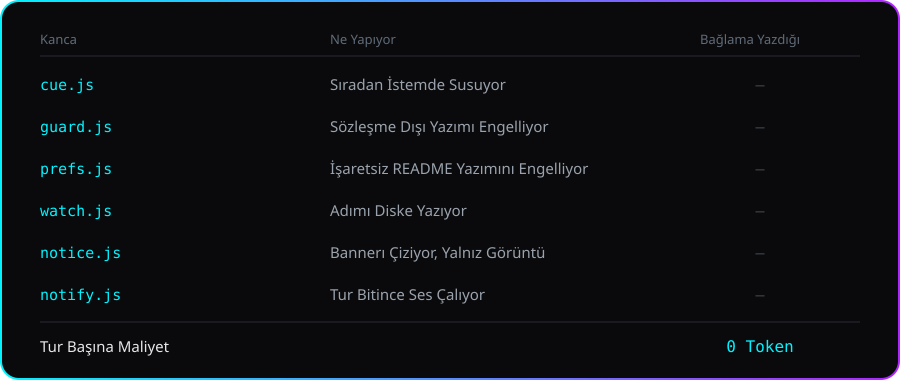

<!-- lang -->

[](README.md)

<div align="center">

</div>

# Teknesyum Core

Çok Amaçlı İş İstasyonu

---

## Nedir

Teknesyum Core, Claude Code için tasarlanmış çok amaçlı bir plugindir. Büyük işi küçük
sözleşmelere böler: her sözleşme hangi dosyalara sahip olduğunu ve bittiğini nasıl
kanıtlayacağını yazar. Ajanlar paralel çalışır, her işe boyuna uygun model gider ve hiçbir
sözleşme doğrulama komutları gerçekten geçmeden kapanmaz.

Kendi uygulamalarımı geliştirirken kullandığım plugin bu; şekli de oradan geliyor. İçindeki
her şey gerçek bir projede gerektiği için var. Muhtemelen ben uygulama geliştirmeye devam
ettikçe güncelleme almaya devam edecek.

---

## İşi kim yapıyor

`t0`, konuştuğunuz oturumun kendisi. Kodu o yazmıyor: işi sözleşmelere bölüyor ve her birini
bir ajana veriyor.

<div align="center">

</div>

Ajan türü tek. Rol, ajana okuması söylenen bir dosya; yani rol açıklamaları sizin
bağlamınızda oturmuyor — rolün bedelini yalnız o rolü taşıyan ajan ödüyor.

| Rol | Ne yapıyor |
|---|---|
| `t0` | oturumun kendisi — işi böler, sözleşmeleri açar, diğerlerini çağırır |
| `planner` | bölünmeyi önerir: id'ler, sahiplenilen dosyalar, verify komutları. Kod yazmaz |
| `builder` · `ui-builder` | sözleşmenin istediğini yazar, yalnız `owns` listesinin içinde |
| `scout` | sıfırdan bir proje mimarisini almadan önce önceki işleri okur |
| `scribe` | karar taşımayan mekanik iş: yeniden adlandırma, dil, envanter |
| `auditor` | yüksek riskli sözleşmeyi bağımsız doğrular, tek dosyaya bile yazamaz |
| `advisor` | tek soru, tek görüş; soranın bir üst basamağındaki modelden |

Hangisine hangi modelin gideceği ajan ajan sizin seçiminiz değil — modla rol birlikte karar
veriyor, [tablo](#ajanlar) aşağıda.

---

## Özellikler

- **İşe göre model** — Basit iş güçlü modele gitmez; kimse faturayı sevmiyor. Rol ve profil
  modeli ve eforu birlikte seçer, üst üste başarısızlık ikisini de yükseltir.
- **Riskten haberdar** — Risk diff'ten hesaplanır. Yüksekse kapanış denetim kaydı ister ve
  kayıt gerçekten koşmuş bir ajanı adıyla göstermek zorunda.
- **Rol dosyaları** — Yapıcı, planlayıcı, denetçi, danışman. Rol metnini yalnızca o rolü
  taşıyan ajan ödüyor, sizin oturumunuz değil.
- **Banner ve statusline** — O an ne olduğunu tek satırda söyler. Pano değil.
- **Devir notu** — `.claude/relay/HANDOFF.md` projenin nerede olduğunu yazar: ne açık, en
  son ne kapandı, hangi dal. Oturum biterken bir kanca tazeler, yani bedeli yok; Claude
  değil, herhangi bir model okuyabilir.
- **Ajanı çağırmadan sor** — `contract.js precheck` verify adımlarını önce çalıştırır.
  Zaten geçiyorsa iş bitmiştir, ajan açmaya değmez.
- **Başarısız olabilen kabul** — Her adımı `true`, `echo` ya da yorum olan bir `verify`
  bloğu kabul ölçütü değildir. Kapı bunun üstüne kapatmaz ve nedenini söyler.
- **Tavan** — Sözleşme kaç adım ettiğini yazabilir. Tavanı geçince sözleşme yazılabilir
  olmaktan çıkar; yakınsamayan koşu kendiliğinden durur.
- **Geri dönülebilecek bir sabit** — `precheck`, iş başlamadan izlenen ağacı
  `refs/teknesyum/<ID>` olarak kaydeder; `revert` sahiplenilen dosyaları oraya geri koyar.
- **Sahipsiz kalan iş kayda geçer** — Oturum biterken hâlâ `active` olan sözleşme deftere
  yazılır ve statusline'da görünür. Bağlamınıza tek kelime yazılmaz.
- **`doctor`** — Kurulumun sağlam olup olmadığını tek komut söyler: sürümler, tablo, roller,
  kancalar, statusline ve defterde karşılığı olmayan kapanış var mı.

---

## Üç mod

Core üç moddan birinde çalışır — `eco`, `normal`, `premium`. Mod, tier tablosundan bir sütun
seçer; sütun da her role hangi modelin ve hangi eforun gideceğine karar verir.

| Mod | Ne için |
|---|---|
| `eco` | Uzun ve ucuz oturumlar. İşi Haiku ve Sonnet yapar, danışman açıktır. |
| `normal` | Gündelik iş. Sonnet yapar, Opus planlar ve denetler, danışman yok. |
| `premium` | İlk seferde doğru olması gereken iş. Baştan sona Opus, danışman Fable. |

**Modu siz ayarlarsınız, plugin sizin yerinize değiştirmez.** Bu bir eksik değil, tasarım:
tavan sizin verdiğiniz bir karar olduğunda tüketim minimal kalır. Sinyaller mod içinde tek
bir hücreyi yükseltebilir — üst üste başarısızlık, yüksek risk — ama mod onları sınırlar ve
modun kendisini hiçbir şey yükseltmez.

Birini seçin ve çalıştırın:

```bash
node ~/.claude/plugins/cache/teknesyum/teknesyum-core/*/scripts/setup.js --profile eco
```

```bash
node ~/.claude/plugins/cache/teknesyum/teknesyum-core/*/scripts/setup.js --profile normal
```

```bash
node ~/.claude/plugins/cache/teknesyum/teknesyum-core/*/scripts/setup.js --profile premium
```

Mod statusline'da yazar, yani hangisini ödediğinizi her an bilirsiniz. Tek bir depo kendi
modunu `.claude/relay/config.json` içinde sabitleyebilir.

---

## Kurulum

### Windows — tek satır

```powershell
irm https://raw.githubusercontent.com/Teknesyum/Teknesyum-Core/v0.7.1/install.ps1 | iex
```

### macOS / Linux — tek satır

```bash
curl -fsSL https://raw.githubusercontent.com/Teknesyum/Teknesyum-Core/v0.7.1/install.sh | bash
```

**Sonrasında Claude Code'u yeniden başlatın.** Kancalar oturum ortasında yeniden yüklenir
ama masaüstü istemci ürettiklerini yeniden çizmez. Bunu herkes bir kez unutuyor.

İki tek satırlık kurulum da bir etikete bakıyor, `main`'e değil — kabuğa borulayacağınız
şey, dalın bugün ne taşıdığı değil, yayımlanmış betik olmalı. Her sürüm iki kurulum
betiğinin de SHA-256'sını yayımlıyor.

**Gerekli:** Claude Code, git. **İsteğe bağlı:** Node.js. O olmadan statusline ve kapı
betikleri çalışmaz; tahmin ettirilmez, size söylenir.

Kurulum betikleri sonunda kurulumu kendi terminalinizde çalıştırıyor; sorularını orada
bedavaya soruyor. Atladınız mı? Betiği kendiniz çalıştırın:

```bash
node ~/.claude/plugins/cache/teknesyum/teknesyum-core/*/scripts/setup.js
```

**ya da şunu Claude'a yapıştırın:**

> Teknesyum Core'u kur. `node <plugin>/scripts/setup.js --check` çalıştır; `<plugin>` kurulu
> teknesyum-core dizini. JSON basar. `missing` altındaki bütün soruları bana tek mesajda
> sor, sonra `node <plugin>/scripts/setup.js --apply` komutunu uygun bayraklarla çağır.
> Hiçbir ayar dosyasını kendin yazma.

Kurulum `~/.claude/teknesyum/config.json` dosyasını yazıyor ve statusline'ı bağlıyor. Bir
sonraki oturum başında geçerli oluyor.

---

## Nasıl çalışıyor

### Sözleşme

`.claude/relay/contracts/` altında bir markdown dosyası. Bir hedef, sahiplendiği dosyalar,
onu kanıtlayan komutlar.

```markdown
## Goal
Banner kullanıcının dilinde okunuyor.

## owns
core/scripts/statusline.js
core/strings.json

## verify
node test/all.js
```

`owns` dosya sayıyor, dizin değil — dizin, henüz var olmayan dosyalar hakkında verilmiş bir
söz demek. Mutlak yol ya da proje dışı bir yol yazamıyor, ve kimsenin yaratmadığı bir
dosyayı sahiplenen sözleşme kapanamıyor: okunamayan dosya eskiden boş sayılıyor ve
yapılmamış iş geçiyordu.

`verify`, sözleşmeyi kapatılabilir kılan kısım. Kabul ölçütü 0 ile çıkan bir komut olarak
yazılamıyorsa bölme yanlıştır; planlayıcıya da uydurma bir onay kutusu icat etmek yerine
bunu söylemesi söyleniyor.

<div align="center">

</div>

### Kapı

Bir sözleşmeyi kapatabilen tek şey `contract.js complete`. Rapora inanmak yerine verify
komutlarını kendisi çalıştırıyor ve riski, değişikliğin tarifinden değil diff'ten çıkarıyor.

Sözleşme bir merdiven çıkıyor: `open`, `active`, `submitted`, `done`. Yalnız submitted olan
kapanıyor, arşivlenen dosyaya `done` damgası vuruluyor; böylece `done/` altında hâlâ "devam
ediyor" diyen bir dosya kalmıyor.

`contract.js reopen --reason "..."` yanlış kapanan sözleşmeyi turunu artırarak geri alıyor;
kapanan tur defterde kalıyor, yani geri alma bir silme değil bir kayıt. Geri alma altıncı
turda duruyor. Yedinci tur, ajanın şanssız değil sözleşmenin yanlış olduğunu söyler — böl,
ya da sahiplendiğini daralt. Katılmadığınız gün için `--force` duruyor.

Bunların hepsinden önce, `contract.js precheck --id X` iş hiç başlamamışken verify adımlarını
çalıştırıyor. Zaten geçiyorlarsa iş bitmiştir ve ajan açmak israftır. Aynı anda izlenen ağacı
`refs/teknesyum/<ID>` olarak sabitliyor — gerçek bir ref, yani gc alamıyor — ve
`contract.js revert --id X --yes` sahiplenilen dosyaları o noktaya geri koyuyor. Sözleşme
kapanınca sabit iniyor; sahipsiz kalan sözleşme sabitini koruyor, zaten meselesi o.

Her adımı `true`, `:`, `exit 0`, `ls`, `echo` ya da yorum olan bir `verify` bloğu başarısız
olamaz; başarısız olamayan şey de kabul ölçütü değildir. Kapı bunun üstüne kapatmayı
reddediyor ve adımı adıyla söylüyor. Başarısız olabilen tek komut yeter, gerisi gürültü
olabilir.

Sözleşme `ceiling: <n>` taşıyabilir — kaç araç adımı ettiği. Tavanı geçince kapı kancası o
sözleşme altındaki yazmaları kabul etmiyor; yakınsamayan bir koşu kimse başında beklemeden
bitiyor. Satırı olmayan sözleşmeye cömert bir varsayılan veriliyor. Oturum, hâlâ `active`
olan ve hiçbir ajanın tutmadığı bir sözleşmeyle biterse deftere `stale` kaydı düşüyor ve
statusline bunu söylüyor. Bu bir kayıt, çıkışın reddi değil — oturum her zamanki gibi
kapanıyor ve modelin bağlamına tek kelime yazılmıyor.

### Denetim kaydı

Yüksek riskte kapanış, kayıt olmadan reddediliyor ve kayıt dört yerden bağlı:

- sözleşmenin sahiplendiği dosyaların **içeriğine** — denetimden sonra oynayan ağaç artık
  tutmuyor
- **HEAD'e** — başka bir commit için yazılmış kayıt burada geçmiyor
- **gerçekten koşmuş bir run-id'ye** — diskte canlı kaydı olan, rolü denetçi olan ve denetim
  boyunca hiçbir dosyaya yazmamış bir ajan
- **tek kullanıma** — kayıt sözleşme kapanırken tükeniyor, tekrar oynatılamıyor

Her kapanış, her karşılanmamış kapanış ve her geri alma `audits/ledger.jsonl` dosyasına
ekleniyor; `contract.js ledger` de `done/` altında oturan ama defterin hiç duymadığı
sözleşmeyi bildiriyor. Kayıtlar birbirine zincirli değil; her biri kendi bağlarıyla ayakta.

### Kapı kancası

`guard.js`, `Write`, `Edit` ve `NotebookEdit` önünde çalışıyor. Mevcut sözleşmenin `owns`
kümesi dışındaki her dosyaya yazmayı engelliyor — ajan sözleşmesine dokunarak kendini ona
bağlıyor — `audits/` ve `live/` dizinlerini yalnız kapıya bırakıyor, `contracts/done/`
dizinini salt okunur tutuyor. `prefs.js` gerekli işaretleri taşımayan README ya da LICENSE
yazımını engelliyor; yazarın tercih dosyası yoksa hemen çıkıyor, yani başkası için hiçbir
şey yapmıyor.

Kabuk komutlarınızı okumuyor. Bu denetim v0.2.0'a kadar vardı ve düz metin eşleşmesiydi:
`cd` içinden geçip gidiyordu, buna karşılık defteri okuyan meşru bir tek satır
reddediliyordu. Kabuk metnini tahmin etmeye çalışan kapı, korumayı değil koruma sanısını
satın alır — güvence bunun yerine kaydın kendisinde.

Relay'i olmayan bir projede kapı kapalı değil açık düşüyor. Birinin ilgisiz deposunu bozan
bir kanca, kaçırılan bir denetimden daha kötü bir arıza.

### Ajanlar

Tek ajan türü `worker`, rol de istemine bir yol olarak geliyor:

```
Read <plugin>/roles/builder.md and follow it.
Contract: .claude/relay/contracts/T7.md
```

Rol ve mod, [core/tiers.json](core/tiers.json) içinden bir hücre seçiyor; hücre bir model
ve bir efor.

| Rol | `eco` | `normal` | `premium` |
|---|---|---|---|
| `t0` — oturumun kendisi | sonnet | opus | opus |
| `planner` | sonnet/medium | opus/medium | opus/high |
| `builder` · `ui-builder` | sonnet/low | sonnet/medium | opus/medium |
| `scout` | haiku/low | sonnet/low | sonnet/medium |
| `scribe` | haiku/low | haiku/low | sonnet/low |
| `auditor` | opus/medium | opus/medium | opus/high |
| `advisor` | opus/medium | kapalı | fable/medium |

Sinyaller hücreyi yükseltiyor, profil tavanı koyuyor, hiçbir şey aşağı çekmiyor.

| Sinyal | Etkisi |
|---|---|
| Üst üste iki araç çağrısı başarısız | önce efor, sonra model yükseliyor |
| Tur 3 | model yükseliyor |
| Tur 4 | danışman önerilmiyor, zorunlu oluyor |
| Değişiklik geri alınamaz bir yola dokunuyor | denetçi açılıyor |

Üst üste hataları kanca ajan başına sayıyor; bir ajanın kötü günü başka bir ajanın bütçesini
harcayamıyor. Üstelik ikinci hatada davranıyor, çünkü üçüncüyü beklemek bile bile lades
demek.

Proje kendi profilini `.claude/relay/config.json` içinde tutabiliyor; `premium` bir makinede
`eco` bir depo `eco` kalıyor.

**Danışman** soranın bir üst basamağında çalışıyor: sonnet soruyor, opus cevaplıyor; opus
soruyor, fable cevaplıyor. Bir model kendine ikinci görüş veremiyor. Hak kazanma listesi yok
— istemek yeterli sebep — ve danışmana hedef, kabul ölçütü ve kanıt gidiyor; sizin taslak
cevabınız asla.

### Maliyet

Claude Code'un sunduğu her mekanizma bedelini ne zaman ödediğinize göre sınıflanıyor: **S**
bağlam başına bir kez, **O** yalnız özellik çalışınca, **C** her mesajda sonsuza kadar,
**Z** hiç. Bu tablodan tek bir kural çıkıyor — sıradan bir turda hiçbir kanca bağlama
yazmıyor.

<div align="center">

</div>

Sohbet banner'ı `MessageDisplay` kancasında duruyor; bu kanca çizileni değiştiriyor,
saklanana ve modelin gördüğüne dokunmuyor. İkilinin kendi ifadesiyle: *"Display-only: the
stored message and what the model sees are untouched."* Mesaj başına yaklaşık 30 ms node
açılışı, sıfır token.

Araç çağrılarını izleyen kancalar artık matcher taşıyor, yani dosya okumak süreç açtırmıyor.

### Yalnız çağrılınca çalışan araçlar

| Betik | Ne yapıyor |
|---|---|
| `contract.js precheck` | ajan açılmadan önce verify adımlarını çalıştırıyor |
| `contract.js check` | risk, verify adımları ve onların adını verip de var olmayan şeyler |
| `contract.js list` | ne açık, ve bir dosya hangi sözleşmenin |
| `contract.js snapshot` | izlenen ağacı `refs/teknesyum/<ID>` olarak sabitler |
| `contract.js revert` | sahiplenilen dosyaları o sabite geri koyar |
| `handoff.js` | `.claude/relay/HANDOFF.md` dosyasını, projenin durumunu yazıyor |
| `doctor.js` | kurulum sağlam mı söylüyor |
| `release.js` | sonraki sürümü `.changes/` içindeki notlardan belirliyor |
| `update.js` | yeni bir sürüm çıkmış mı söylüyor |
| `map.js` | import haritası — merkezler, döngüler, öksüzler |
| `map.js who <dosya>` | değiştireceğin dosyayı kim import ediyor |
| `log.js` | hata günlüğü; elle yazılmıyor |
| `setup.js` | makine ayarı ve statusline bağlama |

Devir notu ikiye ayrılıyor. Mekanik yarısı — açık sözleşmeler, durumları ve turları, son
kapanışlar, dal, baş, ne kadarı commit edilmemiş, hangi ajan takılmış — oturum sonu
kancasıyla tazeleniyor; bedeli yok ve hiç bayatlamıyor. Öteki yarısı makinenin yazamayacağı
tek paragraf, yani niyet; tazeleme onu koruyor. Dosya düz markdown, yani projeyi sonra açan
model Claude olmasa da okuyabiliyor.

`contract.js check` ayrıca sözleşmede adı geçip de var olmayan şeyleri okuyor: kimsenin
yazmadığı bir betiği çağıran verify adımı kabul ölçütü değil, çalışamayacak bir adımdır ve
bunu kapıda değil iş başlamadan bilmek gerekir. Arkasında dosya olmayan bir `owns` girdisi
ise bilgi olarak bildiriliyor — genelde iş odur.

Yeni sürüm, statusline'ın sonunda tek sönük kelime olarak görünüyor; başka hiçbir yerde —
sohbette değil, modelin bağlamında hiç değil. Sorgu, haftada en fazla bir kez, oturum zaten
kapanırken, kimsenin beklemediği ayrık bir süreçte koşan bir `git ls-remote`. Bu bir garanti
değil bir ipucu: gösterdiği şey doğru, ama susması güncel olduğunuzu kanıtlamıyor.
`node <plugin>/scripts/update.js` şimdi sorar ve açıkça söyler.

Harita üretildiği commit'i damgalıyor. Yoksa üç hafta sonra artık var olmayan merkezleri,
döngüleri ve öksüzleri tam bir güvenle sayardı; onun yerine `doctor` kaç commit geride
olduğunu söylüyor, `map.js who` da aynısını hatırlatıyor.

`doctor.js` `{name, ok, message}` satırlarıyla cevap veriyor ve `--json` alıyor. Neyi
denetlediği, bastığı şeydir; okumak yerine çalıştırın.

---

## Bunu native Claude Code zaten yapmıyor mu?

Bir kısmını evet: alt ajan açıyor, paralel çalıştırıyor, plan tutuyor. Yukarıdaki her şey
Core'un üstüne koyduğu. Kısa hali:

| | Native Claude Code | Teknesyum Core |
|---|---|---|
| "Bitti"ye kim karar veriyor | ajan öyle diyor | `contract.js` verify komutlarını kendisi koşuyor ve geçmeyen kapanışı reddediyor |
| Kabul ölçütü | istemdeki düz metin | 0 ile çıkması gereken komutlar; her adımı `true` ya da `echo` olan blok kabul sayılmıyor |
| Paralel yazma | iki ajan aynı dosyayı ezebiliyor | kapı, sözleşmenin `owns` listesi dışına yazmayı engelliyor |
| Yüksek riskli değişiklik | ayrımı yok | risk diff'ten hesaplanıyor; yüksek riskli kapanış, dosya içeriğine, HEAD'e ve gerçekten koşmuş bir denetçiye bağlı kayıt istiyor |
| Yakınsamayan koşu | sürüp gidiyor | sözleşme `ceiling` taşıyabiliyor, sınırı geçince yazılabilir olmaktan çıkıyor |
| Geri dönmek | kendi git disiplininiz | `precheck` izlenen ağacı gerçek bir ref olarak sabitliyor, `revert` sahiplenilen dosyaları geri koyuyor |
| Oturum bitince | plan uçuyor | sözleşmeler dosya, sahipsiz kalan deftere yazılıyor |
| Model seçimi | alt ajan başına siz seçiyorsunuz | rol çarpı mod hücreyi seçiyor, sinyaller yükseltiyor |
| İkinci görüş | aynı modele tekrar sormak | danışman, soranın bir üst basamağında koşuyor |
| Tur başına maliyet | açıklamalar ve kurallar her mesajda taşınıyor | 0 token; her kanca diske ya da ekrana yazıyor, bağlama değil |

---

## Kullanımda nasıl görünüyor

Her cevabın altında ve üstünde tek satır; o an olup biten en önemli tek şeyi söylüyor. Pano
değil.

```
### Teknesyum ▸ Opus-High Denetçi Atandı > T82 Denetimi Yapılıyor
### Teknesyum ▸ 2× Opus Kâşif · Sonnet-Medium İzci Atandı > Rozet Metni · Kapı Tasarımı Yapılıyor
### Teknesyum ▸ 3× Opus-Medium İşçi Atandı
### Teknesyum ▸ Dikkat — 4 Araç Çağrısı Üst Üste Başarısız
### Teknesyum ▸ 1 Sözleşme Onay Bekliyor · 1 Sözleşme Başlanmadı
```

Satır markdown başlığı olarak yazılıyor; istemci de başlık gibi çiziyor, yani göz okumadan
buluyor.

Ajanlar çalışırken satır her koltuğu hücresiyle birlikte anıyor — `Opus-Medium İşçi`, rol ve
onun çözüldüğü model ile efor demek. Aynı hücreyi tutan koltuklar tek girdide toplanıyor;
`3×` oradan geliyor.

Önce koltuk, `>` işaretinden sonra iş: kim atandı, sonra ne yapılıyor. Ajan bir sözleşmeye
bağlıysa iş, sözleşmenin kendi başlığı — spawn'dan çok sonra da doğru kalan şey; değilse
ajanın çağrıldığı açıklama. Satıra sığmayan kısım sondan atılıyor, yani koltuklar kalıyor,
yeri görevler veriyor.

Görevler listeleniyor, koltuklarla teker teker eşleştirilmiyor: aynı rolde iki ajan varken
hangi görevin hangi koltuğa ait olduğu tahmindir ve satır bunu bildiği gibi gösteriyor.
Hiç açıklama taşımayan bir çağrı için yalnız `Atandı` yazıyor — uydurulmuş bir cevap hiç
cevaptan kötü olurdu.

Üst üste başarısız araç çağrısı her şeyin önüne geçiyor. Kapanış satırı biteni bildiriyor,
çünkü mesajdan sonra hesaplanıyor ve daha fazlasını biliyor. Yalnızca büyüyen sayaçlar —
atılan adım, açık günlük — kesildi: karşılaştıracak bir şeyi olmayan sayı süstür.

---

## Komutlar

Yok. Giriş noktası `relay` skill'i; gerisi betik ve betikler yukarıdaki tabloda.

---

## Yerleşim

```
.claude/relay/
  contracts/           açık iş, sözleşme başına bir dosya
  contracts/done/      kapanan iş, damgalanmış ve arşivlenmiş
  audits/              kayıtlar ve ledger.jsonl
  live/                ajan kayıtları, kanca yazıyor
  config.json          bu projenin profili, sabitlediyse
  HANDOFF.md           proje nerede
  map.md               import haritası
```

`node <plugin>/scripts/map.js` import haritasını yazıyor — merkezler, döngüler, öksüzler,
kenarlar. Okuması dosya açmaktan ucuz ve dosya açmanın cevaplamadığı şeyleri cevaplıyor.

---

## Testler

```bash
node test/all.js
```

Kapı, kapanış, merdiven, denetim kaydı, defter, bilinen kaçış yolları, tablo ve kota
kilitleri, kişisel usul kapısı, iskele, işaret, banner, devir notu ve hiçbir kancanın
bağlama yazmadığı denetimi üzerine 2.438 assertion. Aynı takımı CI Linux, Windows ve
macOS'ta koşuyor; geliştirme Windows öncelikli.

---

## Tasarım notları

- [docs/COST-MODEL.md](docs/COST-MODEL.md) — token nereye gidiyor ve bundan çıkan kural
- [docs/TRIAGE.md](docs/TRIAGE.md) — Teknesyum Base'den ne geldi, ne gelmedi
- [docs/DECISIONS.md](docs/DECISIONS.md) — bunu şekillendiren kararlar ve gerekçeleri

---

## Katkı

Kod yazmadan önce bir issue açın — yamanızın bir şeyle çarpıştığını sonradan öğrenmekten
hızlıdır. Pull request'i küçük tutun; tek iş yapan diff aynı gün okunur, beş iş yapan diff
hiç okunmaz.

Depo İngilizce yazılıyor. Katkılar buradaki her şeyle aynı lisansla, AGPL-3.0-or-later
altında geliyor; imzalanacak CLA ve yapılacak tören yok.

Vaktinizden kazandırıyorsa [çalışmayı destekleyebilirsiniz](https://github.com/sponsors/Teknesyum).

---

## Destek

Eklenti ücretsiz ve ücretsiz kalacak — AGPL, ücretli sürüm yok, satın almanız için kenarda
tutulan özellik yok. Kötü bir merge'ü ya da bir öğleden sonranızı kurtardıysa, destek bunu
söylemenin bir yolu.

Yardım etmenin ücretsiz yolları da var: hataları bildirin, yapıcı eleştirilerinizi yazın,
bir arkadaşınıza tavsiye edin.

<!-- signature -->
<div align="center">

<a href="https://github.com/sponsors/Teknesyum"></a>
&nbsp;
<a href="LICENSE"></a>

</div>
